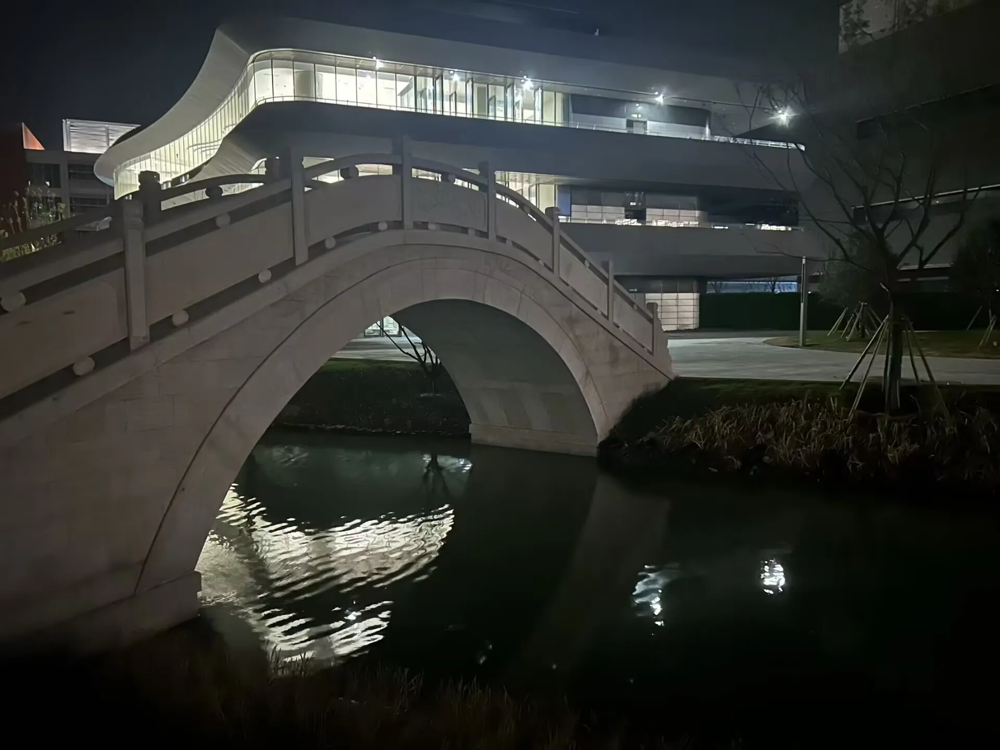
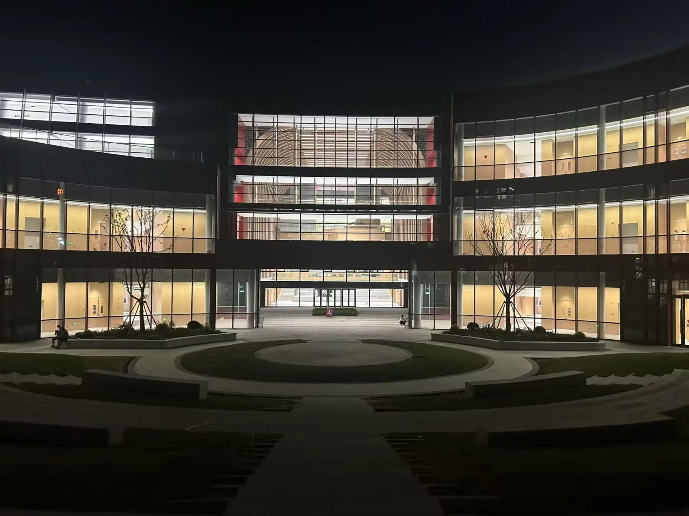

主要由Jasonの大北斗同学来稿

## 食
### 食堂就餐
目前苏州校区食堂有四处餐厅，分别是十六食堂、十七食堂、十八食堂以及科创大厦餐厅。前三者是师生食堂，后者为培训用餐、接待餐以及部分师生用餐。东区仁园中为十七食堂，十七食堂下方为十六食堂，二食堂实为十八食堂，一食堂暂未启用

具体位置如图所示：

相较于鼓楼食堂，苏州食堂的价格更为透明，每个窗口都会明码标价，不用担心“刺客”的问题，而且饭餐的味道还是很好吃的，绝对的一分钱一分货。

苏州食堂的营业时间和鼓楼食堂基本接近，食堂用餐也要做好时间安排哦！

未正式命名建筑 猜测第十九餐厅（图片为Rrrat同学提供）

### 外卖
苏州也是可以点外卖滴！大家要打破不能点外卖的偏见，虽然能选择的种类确实比鼓楼少了很多，但是有这么好吃的食堂，外卖也就可以少点一些啦！

校区东门是有外卖柜的，临近校门的花坛上也有放置外卖的悬挂置物架，人流量少的时候就会放置在这里。

但是苏州校区的地理位置确实比较偏，外卖送达时间比较长，同学们点外卖要把握好时间。

### 一些大家可能比较关心的问题
Q：有便利店吗？

A：校园内有全家便利店，不过价格就没有鼓楼的教超那么友好了。具体位置就在宿舍群中心，步行2min即可抵达

## 住
## 行
### 校内出行
虽然现在苏州校区只开放了东校区但个人感觉东校区的建筑有些错综复杂，不清楚方向的话还是很容易迷路的，但宿舍区和教学区目前还不算太远，走路基本可以覆盖。

目前西校区已竣工并逐步投入使用，步行可能就稍显吃力。

### 校外出行
南京大学苏州校区位于苏州市虎丘区，距离苏州市中心较远。主要依靠轨道交通等公共交通与商圈交通。

出行如果乘坐公共交通，务必走**东门**出，只有东门有直达的有轨电车！！！

校区的正大门处没有直达的公共交通，还需要步行一段距离！

苏州的高铁站到苏州校区的距离都不算近，具体出行方式如下：

**苏州新区站：**自苏州新区站出站向向右走大约100m再右拐，可见地下通行隧道。步行穿过通行隧道后到达轨道交通车站，注意观察车站车牌来车方向和来车时间。可使用微信小程序“苏e行”刷码或支付宝扫二维码支付， 或使用带有交通联合标志的乘车卡支付 ，单程票价2元，时间约40min（比某缺德地图上预计的1h要快），到站即可看到南京大学苏州校区东门正门。

**苏州站：（1）**有轨电车1号线（龙康路站—狮子山站）转轨道交通1号线（狮子山站—广济南路站）转轨道交通2号线（广济南路站—苏州火车站）预计80min，但要步行一段路到有轨1号线

**（2）**有轨电车2号线（南京大学东—苏州新区火车站）转轨道交通6号线（苏州新区火车站—苏锦站）转轨道交通4号线（苏锦站—苏州火车站）预计100min

**苏州北站：**有轨电车1号线（龙康路站—狮子山站）转轨道交通1号线（狮子山站—广济南路站）转轨道交通2号线（广济南路站—高铁苏州北站）预计95min，但要步行一段路到有轨1号线

**值得注意的是，在放假归家期间，学校会安排定制公交线路，和小蓝鲸定制巴士性质相似，来到苏州后记得加群哦！**

## 学

苏教楼夜景（图片为Rrrat同学提供）

## 购
### 附近的大型商圈
这一点就看出来苏州校区比较偏僻了，附近没有特别近的商贸中心，但已经在建设中了

（1）科技城丰茂里：距离校区2.5km，内含星巴克、必胜客、肯德基等连锁品牌

交通方式：有轨电车2号线（南京大学东—漓江路）转363路（漓江路普陀山路南—彭山实验幼儿园）

（2）时尚水岸星悦萃：距离校区2.8km

（3）梦之城购物中心：距离校区3km

### 网购
网购的话，快递地址是：**苏州市虎丘区太湖大道1520号南京大学东校区（邮政快递服务中心）**

快递会送到校园内的菜鸟驿站，具体地址在勇园甲楼1楼，门前有邮局的标牌

### 校内购物
校内目前只有便利店，而且商品不是特别丰富

打印的话，校内有专门的打印店，应该与仁园己楼的入口正对着

理发店和打印店在相同的位置

## 医
### 校内就医
学校内是有医院的，就在勇园丙楼一楼，门口有很明显的标牌，急诊24h开放，门诊8:00到20:00，不过需要办理异地就医，不然得自费，不能用社保卡

电话：0512-68765120

### 校外就医
南京大学医学院附属苏州医院（苏州科技城医院）

距离校区4km

### 

## 

左图为甲区平面图，右图为丙区平面图（图片为Rrrat同学提供）

