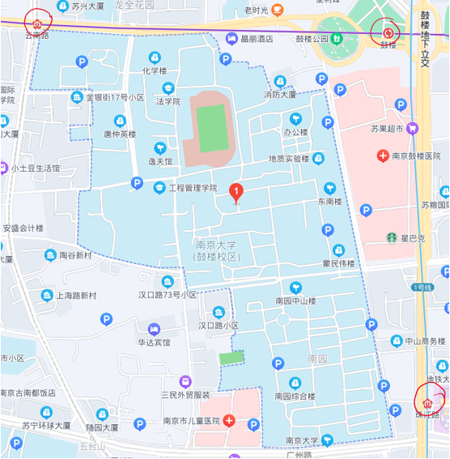

[南哪助手长期接受同学们投稿](https://www.yuque.com/greatnju/q-a/gw3phd#o8osi)

---

## 交通
1. 校园周围地铁站为：

①珠江路站（1号线）：近宿舍区（南园）广州路门，位于校园东南方；

②鼓楼站（1&4号线）：近北园东门（天津路门），位于东北方；

③云南路站（4号线）：近北园西北门（金银街门），位于西北方

2. 校内及周围有较多支付宝，青桔，美团，7MA（小紫车）的共享单车。

## 设施
### 打印店
+ 汉口路：竹青（性价比之王）（汉口路上打印店很多，只写出一个是有原因的）
+ 北京西路：尚彩优印（学校附近专业程度最高的一家打印店）

### 修车&配钥匙
+ 修车+配钥匙：汉口路与青岛路交界处，一位老师傅推着推车
+ 配钥匙：金银街与北京西路交界处

### 体育设施
五台山体育中心。

### 医疗设施
自2023年1月1日起，所有教职工与参保大学生在南京医保定点医院（包括校医院）就医均需持医保卡（即社会保障卡）就医，否则为自费承担。

[校医院指南](https://www.yuque.com/greatnju/q-a/biclkw0cmlmn2vz6)

+ 南京大学医院：位于南园，平时只开放汉口路门，校内门位于南园屋舍北边正常不开放，可以关注南京大学医院公众号，会更新校医院最新新闻（例如开放时间变更，疫苗预约等），疫苗预约及核酸预约需微信登录“南京大学医院”进行预约。
    - 南京大学医院网站：[https://hospital.nju.edu.cn](https://hospital.nju.edu.cn/)
+ 南京大学心理咨询室（鼓楼校区）：位于南园21舍202，电话 83597219，咨询前需电话预约。
+ 南京大学医学院附属鼓楼医院本院：中山路321号（从天津路进入），注意提前公众号挂号，部分科室号很难挂，等号时间较长。大多提前一周放号。
+ 南京市儿童医院：广州路72号
+ 南京市口腔医院：中央路30号
+ 江苏省口腔医院：上海路1号
+ 南京脑科医院：广州路264号

## 鼓楼游乐鉴
### 美食篇
+ 汉口路：好又多超市、水果店（不建议在汉口路和青岛路交界的那家水果店购买，坏果率较高）、罗森便利店、苏式面馆（甜口细面）、兰州牛肉面、石锅坊、石锅拌饭、张亮麻辣烫、黄焖鸡米饭、三猫黑鱼花（已搬迁至珠江路及及广场，南大学生凭校园卡可享折扣优惠）等。
+ 吉兆营：很多小吃。
+ 广州路：很多小吃，且有离学校最近的麦当劳、肯德基、永和大王。
+ 珠江路金鹰：离学校最近的商场，有新白鹿、茶颜悦色等。
+ 小粉桥：小粉桥猪蹄、西安面馆、桂皖小吃螺狮粉等。
+ 青岛路+平仓巷：金麦笼大包坊、鸡蛋灌饼、新疆玉石买买提烧烤、烤冷面、宜宾燃面等，凡几咖啡。
+ 南阴阳营：住宅区菜场，有大叔披萨等。
+ 南秀村：有很多外国料理，秀·爱尔兰西餐吧、Secco Restaurant＆Bar德式餐吧、成都娃娃（川菜馆，不是很辣）等。
+ 金银街：老地方，见舍咖啡。
+ 上海路：老马牛肉拉面，熊猫一间店（奶茶店），云中食品店，靖小馆。
+ 东南大学附近：吴叔烧腊，食物招领，老玉米烧烤。

### 出游篇
鼓楼附近景点：玄武湖公园（附近有鸡鸣寺）、红山动物园、钟山风景区、南京博物院、东南大学四牌楼校区、南京师范大学随园校区等。

### 购物篇
附近商场：环亚凯瑟琳广场，鼓楼·荔枝广场，绿地中心·紫峰购物广场，金鹰国际购物中心（珠江路店），新世界百货，艾尚天地，新街口商圈。

---

[南哪助手长期接受同学们投稿](https://www.yuque.com/greatnju/q-a/gw3phd#k6p5Y)

