[南哪助手长期接受同学们投稿](https://www.yuque.com/greatnju/q-a/gw3phd#o8osi)

---

南京大学鼓楼校区（部分）2006年作为“金陵大学旧址”被国务院列为全国重点文物保护单位。

金陵大学原是美国基督教会创办的一所私立大学，肇始于清光绪十四年(1888)。美国基督教美以美会的传教士傅罗于1888年在干河沿创办汇文书院（Nanking University），是美国教会在南京创办的第一所高等学校，首任校长为福开森（J. C. Ferguson）；1891年美国基督会建立基督书院；1894年美国长老会创办益智书院。1906年基督书院和益智书院合并为宏育书院。1910年2月，宏育书院并入汇文书院，定名为金陵大学堂（University of Nanking），推荐包文（A. J. Bown）任学堂监督（即校长），由著名书法家、两江师范学堂监督李瑞清题写校名“金陵大学堂”。此后监督改称校长，学堂也随之改称为金陵大学。1949年后，由政府接办，改建为公立金陵大学。到1952年院系调整时与南京大学合并，历程64年。

金陵大学聘请美国芝加哥帕金斯建筑事务所（Perkins, Fellows & Hamilton Architects）规划、设计校舍建筑，由陈明记营造场负责全部建造工作。校园于1917年开放启用，其设计综合了三种规划与设计的理念与影响：西方学院规划中典型的围合式建筑组团与大草坪，传统中国元素大型坡顶以及拆除部分城墙后回收而得的青灰色城砖，以及帕金斯建筑事务所教育类建筑规划、室内布局及开窗形式的设计手法。

建筑材料除屋顶用瓦、墙砖等基本材料外，所需木材、水泥、玻璃等大多从国外进口，乃至大楼前的草皮也从美国运来。它的总体特色是中西合璧的建筑风格和气氛，即主要建筑沿一条南北主轴线布置，建筑形式体现中国北方官式建筑的特征，而北大楼的体量组合方式却是西式的，总体布局中的几何规则式绿地、广场也与美国大学校园相类似。今存旧址建筑的东大楼、西大楼、北大楼、图书馆、东北大楼、礼拜堂、学生宿舍等十余幢建筑，一律青砖流水墙，歇山顶覆灰筒瓦。

注1：金陵大学老校园建筑多数（包括北大楼、东大楼、大礼堂、学生宿舍等）出自帕金斯建筑事务所之手，其事务所建筑师司斐罗（A. G. Small）担任驻场工程监理师、现场建筑师，而在众多资料中均误把司斐罗认为这些单体建筑的设计师。各栋单体建筑的设计师暂无考证，在后文中建筑师均称帕金斯建筑事务所。（详见参考文献[3]）

注2：芝加哥帕金斯建筑事务所之后代Perkins Eastman建筑事务所承接了苏州校区北大楼风貌区的建筑设计。

## **1. 北大楼**
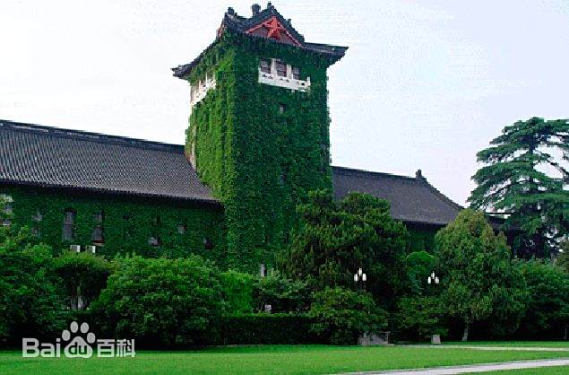

别名：行政楼，塞万伦斯楼

年代：1919年

类别：近现代重要史迹及建筑/国家级文保 (批次:6)

北大楼是金陵大学的主楼，因位于校园中轴线的最北段而得名，当时称“行政楼（Adiministration Building）”，由美国人赛万伦斯先生（Mr. Severance）及其子捐资而建，故亦称塞万伦斯楼（Severance Hall）。此建筑建于1919年，由帕金斯建筑事务所设计，陈明记营造厂承建。建筑面积3473平方米。大楼地上二层，地下一层，中部塔楼五层，砖木结构，采用中国传统的建筑形式设计，同时又糅合了西方的建筑布局。大楼为歇山顶，筒瓦屋面。在大楼南立面的中部，建有一座高五层的正方形塔楼，将大楼分隔成对称的东西两半，塔楼顶部又冠以十字形脊顶，实际上是西洋式钟楼的一种变形。大楼墙壁用明朝城墙砖砌筑，清水勾缝。墙面布满了爬藤植物。这幢大楼现已成为南京大学的标志性建筑。

曾同时作为行政办公室、图书馆、期刊室、博物馆和教室使用。

现归属新生学院。

## **2. 西大楼**
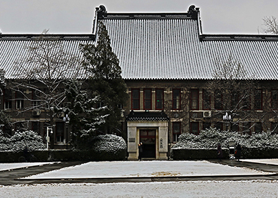

别名：农学院，裴义理楼

年代：1925年

类别：近现代重要史迹及建筑/国家级 (批次:6)

西大楼原称农学院（West Science Building），亦称裴义理楼（Bailie Hall），建于1925年，由帕金斯建筑事务所设计（待考证），陈明记营造厂承建。当时为纪念农科创办人、美国人裴义理而命名为“裴义理楼”。建筑面积3604平方米。平面为长方形，内廊式布局。大楼地上二层，地下一层，砖木结构。歇山顶，筒瓦量面。大楼底部为明代城墙砖砌筑，上部为烟色粘土砖砌筑。勒脚部位和门窗过梁采用斩毛青石。

现为数学系系楼。

## **3. 东大楼**

别名：科学馆，理学院，斯沃士楼

年代：1917年

类别：近现代重要史迹及建筑/国家级 (批次:6)

东大楼当时称“科学馆”，亦称理学院（Science Building）、斯沃士楼（Swasey Hall），落成于1917年，由美国芝加哥帕金斯建筑事务所设计，陈明记营造厂承建。建筑面积3905平方米。平面为长方形，内廊式布局。大楼地上三层，地下一层，砖木结构。大楼设计采用中国北方建筑形式，歇山顶，筒瓦屋面，屋顶脊中加脊，中部高耸，外墙采用青砖砌筑，素灰勾缝。大楼入口处建有突出的门套。大楼在50年代因火灾烧毁屋顶，1958年修复。

现归属艺术学院。

## **4. 东北大楼**
别名：东北楼

年代：1935年

类别：近现代重要史迹及建筑/国家级 (批次:6)

东北大楼建于1935年，陈明记营造厂承建。建筑面积1726.4平方米。混合结构，高四层，卷棚式屋顶，筒瓦屋面。外墙用烟色粘土砖砌筑。大楼入口处有栈道直通二楼。

2022年大楼入口完成改造。

现为

## **5. 学生宿舍**
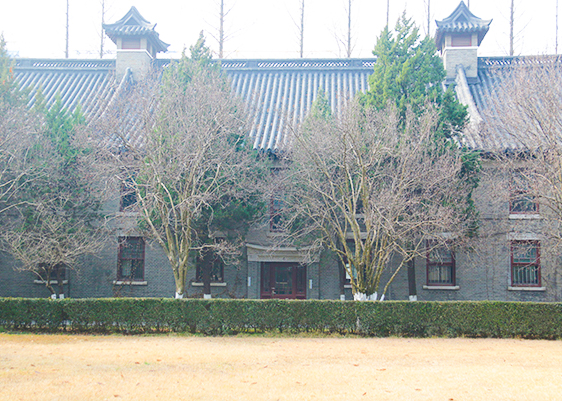

别名：甲乙楼、丙丁楼、戊己庚楼和辛壬楼

年代：1925年（待考证）

类别：近现代重要史迹及建筑/国家级 (批次:6)

学生宿舍共有四幢，分别称为甲乙楼、丙丁楼、戊己庚楼和辛壬楼。建于1925年。陈明记营造厂承建。砖木结构，卷棚式屋顶，筒瓦屋面，外墙用烟色粘土砖砌筑。甲乙楼与丙丁楼大小相同，建筑面积均为755平方米；戊己庚楼与辛壬楼大小相同，建筑面积均为1685平方米。

甲乙楼现为；丙丁楼现为；戊己庚楼现归数学系使用；辛壬楼现为

## **6. 礼拜堂**
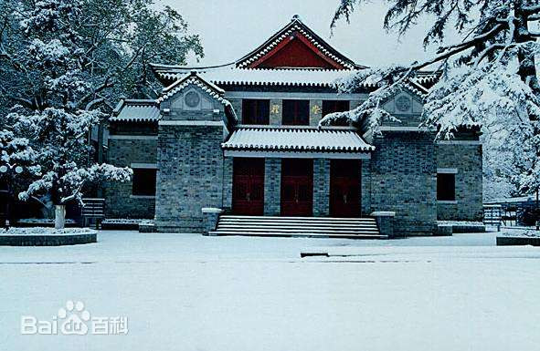

别名：大礼堂，礼堂，戴礼拜堂

年代：1918年

类别：近现代重要史迹及建筑/国家级 (批次:6)

礼拜堂（Chpel）现为南京大学大礼堂，亦称戴礼拜堂（Day Chapel）。由美国芝加哥帕金斯建筑事务所于1917年3月28日完成设计，陈明记营造厂承建，1918年竣工。它是金陵大学现存最早的建筑物。建筑造型仿照中国古代的庙宇。地上二层，砖木结构，屋顶主跨为歇山顶，附跨为硬山顶，筒瓦屋面。外墙用明代城墙砖砌筑，城砖上仍留有铭文印记。1958年在大门入口处加筑了一座门厅；2002年百年校庆校园改造时将门厅拆除，恢复原状。

现偶尔举行大型活动使用。

## **7. 小礼拜堂**
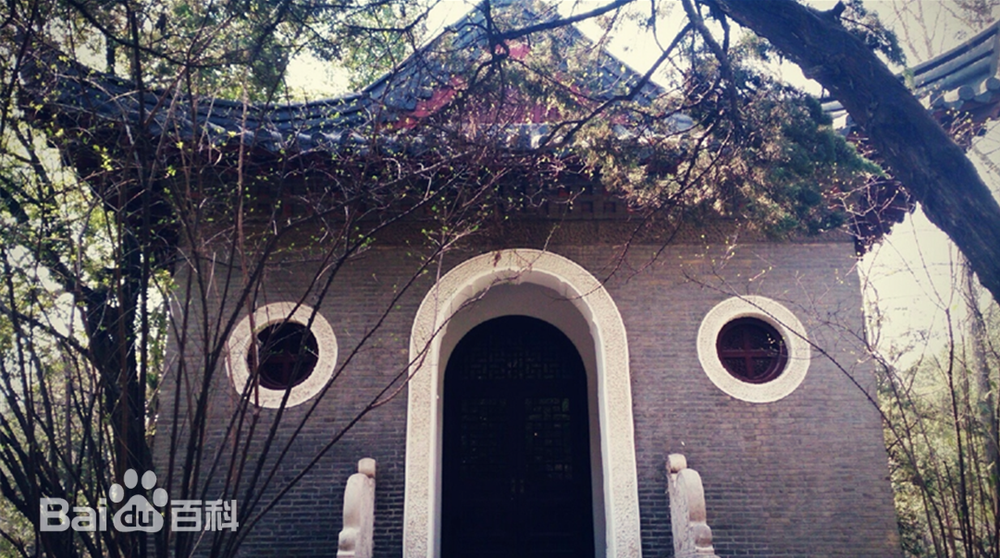

别称：戴籁三纪念堂（Twinem Memorial Chapel），戴氏祈祷室

年代：1933年（待考证）

类别：近现代重要史迹及建筑/国家级 (批次:6)

小礼拜堂落成于1933年，由曾留学美国的民国最早的著名建筑师齐兆昌、美国费洛斯与汉密尔顿建筑师事务所共同设计，目前为重修。

小礼拜堂又称戴籁三纪念堂（Twinem Memorial Chapel），是戴籁三富人为纪念逝世的丈夫带懒散先生捐建。戴籁三先生为金陵大学圣经课教室，1923年去世。小礼拜堂主要用于灵修、祈祷和小规模宗教集会。小礼拜堂为单层建筑，单檐歇山顶，拱形门，两侧开小圆窗。大门上方是三面包围的结构，既可支撑墙体，又有装饰作用。

现空置。

## **8. 金陵大学图书馆**
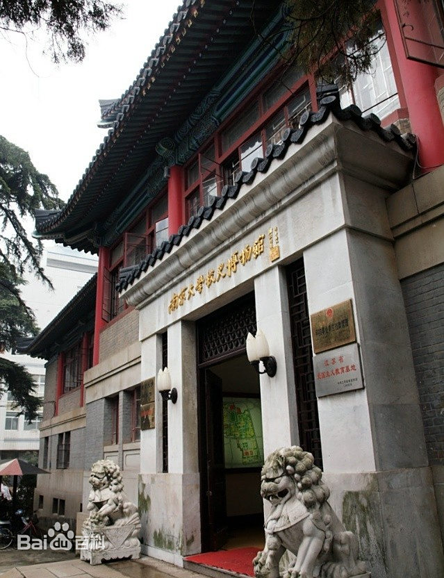

别名：校史博物馆

年代：1936年

类别：近现代重要史迹及建筑/国家级 (批次:6)

图书馆与北大楼共同构成金陵大学校园的中轴线，其他的建筑物基本上都分列在这条中轴线的两侧。图书馆建于1936年，由基泰工程司建筑师杨廷宝设计，陈明记营造厂承建。建筑面积2626平方米。地上二层，地下一层，钢筋混凝土结构，歇山顶，青筒瓦量面，青砖墙面。建筑平面为十字形。一层中部为主要入口，面朝北，两侧为图书采编等业务办公用房以及小阅览室：二层中部为借书处，两侧各有一个大阅览室。图书馆的外部处理与其他几幢建筑物风格相近。图书馆建成后，有人为纪念在1927年3月24日被攻克南京的北伐军士兵打死的金陵大学副校长、美国人文怀恩，主张命名为“文怀恩图书馆”，并在馆前建立铜像，后来考虑到金陵大学学生的反帝爱国情绪，这个提案不了了之。

校史博物馆门前树立有“二源壁”

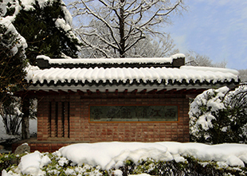，一面刻着“两江师范学堂”，一面刻着“金陵大学堂”，分别代表南京大学的两个源头。两江师范学堂的名牌系一整块石材制成，书写字体为魏碑体，内填绛红色漆；金陵大学的校牌一石一字，由五块石材组成，书写字体为柳体隶书，内似填金色漆。两块校名牌均为时任两江师范学堂监督的李瑞清先生所提。（出处：南京大学公众号）

现作为校史博物馆使用（另在仙林校区设有校史馆为沈小平楼），开放时间周一-周五上午08:30-12:00、下午13:30-17:00。

## **9. 金陵大学难民收容所及死难同胞从葬地**
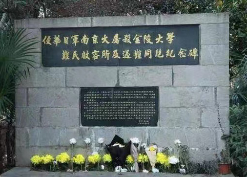

年代：1937年

类别：近现代重要史迹及建筑/国家级 (批次:6)

一九三七年十二月，日军侵占南京时，留在南京的外侨代表，为了收容我未及撤离的大批难民，以原金陵大学等处为中心，在城内设立了“国际安全区”占地约三点八六平方公里，内设二十五个难民收容所，收容难民约二十五万人，其中，原金陵大学校园本身就是较大的难民收容所之一，收容难民多达三万余人。 原金陵大学附近，也是侵华日军对我遇难同胞实施集体屠杀的场所之一。一九三七年十二月二十六日，日军以辩理难民“登记”为由，将避难于原金陵大学图书馆内之两千余名难民，迫令集中在网球场上（现该地已建为地质实验楼），从中搜捕了三百余名青壮年，驱至五台山及汉中门外悉加杀害。 原金陵大学校园范围内，也是我遇难同胞尸骨丛葬地之一。据当时慈善团体红卍字会埋尸资料记载：一九三八年一、二月间，该会曾先后在城北各处收殓，于金银街原金陵大学农场及阴阳营南秀村埋葬遇难者尸体达七百七十四具。五十年代，南京大学在南秀村建设天文台时，还曾掘出过这批尸骨。 前事不忘，后事之师。今立此碑，永志哀痛，籍慰死者，兼勉后人;自强不息，振兴中华。

## **10. 拉贝故居**
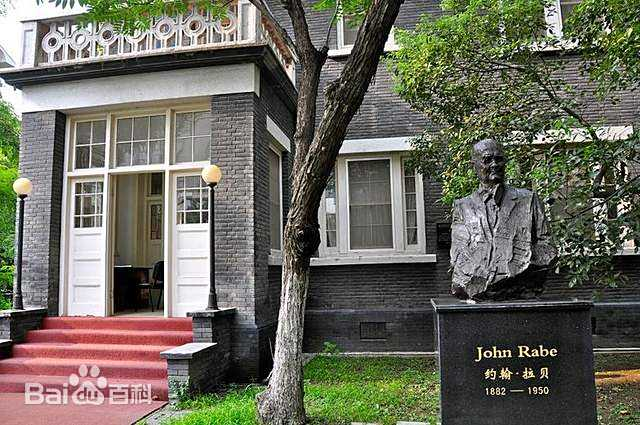

年代：1934年

类别：近现代重要史迹及建筑/国家级 (批次:7)

拉贝旧居建于1934年夏天，约翰·拉贝同金陵大学农学院院长谢金声签订了一份协议，由学校建这座集办公和居住于一体的房屋出租给拉贝。

整个建筑占地面积约1905平方米，有高为2层的西式楼房（主楼）1幢，建筑面积410平方米，另有西式平房（附楼）6间240平方米。院内原有一座小型花园，西北侧有一地下防空洞。

约翰·拉贝（John Rabe，1882-1950），德国人，德国西门子公司南京分公司经理。在日军侵占南京期间，拉贝带领一批国际友人建立“南京安全区国际委员会”，被推选为主席。在3.86平方公里的安全区范围内，建立了25个难民收容所，为约25万中国人提供了避难场所。仅在小粉桥1号的拉贝住宅和他的小花园里，拉贝就保护了600多名中国难民。拉贝在旧居内将所见所闻以日记和其他文件的形式详实地记述了侵华日军在南京犯下的一桩桩令人发指的暴行。日记的问世，立即在全世界引起了极大轰动，约翰·拉贝这个名字也随之驰名世界，被誉为中国的“辛德勒”。

现开放参观。

## **11. 何应钦公馆旧址**
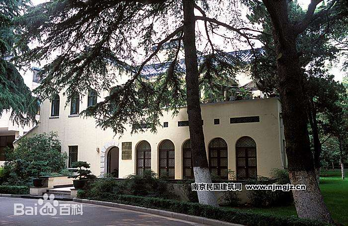

别名：斗鸡闸

年代：1934年

类别：近现代重要史迹及建筑/省级 (批次:6)

何应钦公馆始建于1934年，著名建筑师沈鹤甫设计，辛峰记营造厂承建，西式风格别墅。1937年12月毁于战火。1945年秋，何应钦回南京后在原址又予重建，翌年3月竣工。重建后的何公馆坐北朝南，西班牙式风格，占地面积7782平方米，建筑面积2869平方米，计有二层楼房3幢，三层楼房1幢，四层楼房7幢，另有附属平房。现仅存1幢楼房，此楼坐北朝南，高三层，坡屋顶上铺蓝色琉璃筒瓦，拱形门窗，黄墙砖框，建筑面积869平方米，现该处为南京大学外宾接待处，房屋保护很好。

何应钦(1889-1987)，字敬之，贵州兴义人，日本士官学校毕业，国民党陆军一级上将。1924年任黄埔军校总教官，参与组建国民党军队。1935年7月与日本签订《何梅协定》，使中国北方大片国土沦入日本之手。抗战后历任参谋总长、中国战区陆军司令、联合国军事参谋团中国代表团团长等职。1941年与蒋介石策划皖南事变。1945年代表中国政府接受日军投降，支持蒋介石发动内战，任国民党当局国防部长。李宗仁代总统时任行政院长。赴台后任“总统府战略顾问委员会”主任委员等职。1987年逝世于台北，著有《日军侵华八年抗战史》。

现为外事办公室。

## **12. 赛珍珠旧居**
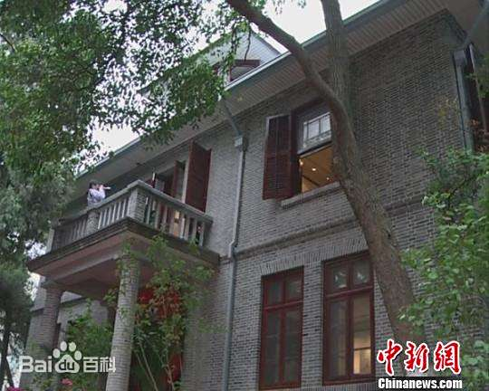

年代：1912年

类别：近现代重要史迹及建筑/省级 (批次:6)

赛珍珠旧居始建于1912年，占地面积约120平方米，总体建筑面积为356平方米。该楼坐西面东，砖木结构，地面二层，地下一层，四坡顶，青瓦，楼顶建有老虎窗，大门口建有雨蓬，以四根古典风格的圆形立柱支撑。是一幢具有典型西洋风格的小洋楼。现该处为南京大学办公楼，房屋保护较好。

赛珍珠（Pearl SydenstrickerBuek）（1892-1973），美国人，美国著名女作家，她出生在美国佛吉尼亚洲，父亲为在华长老会传教士。她出生刚4个月便被父母带到中国，后在镇江和上海读书。她在中国长大，深受中国传统文化的熏陶。因崇拜中国清末名妓赛金花而取名赛珍珠。17岁时她回到美国进入佛吉尼亚洲伦道夫——梅康女子学院学习心理学，毕业后返回中国。1921年至1931年期间，她任金陵大学（南京大学前身）外语系教授时就住在这幢小洋楼。

## **13. 文怀恩故居**
别名：文宅

年代：1911-1912年

类别：近现代重要史迹及代表性建筑/市县级

文怀恩故居落成与1911年前后，是鼓楼校区现存建成历史最久的建筑物，作为时任南京大学副校长文怀恩博士（John Elias Williams，1871-1927）私宅使用，以“文宅”之名在金陵大学校产分布图（1919）中编为第九号住宅。文怀恩博士是金陵大学创办人之一，在金陵大学创办发展、鼓楼校园规划建设、对外合作交流等方面均有重要之贡献与影响。文宅由主楼与附楼两部分组成。主楼在前（南侧），造型规整，外观具典型美式小型住宅风格，附楼在主楼西北侧后方，内置辅助空间，共同构成一个独立完备的居所建筑。文宅主、附楼均采用砖木结构体系。

自文怀恩博士于1927年“南京事件”（Nanking Incident）中不幸遇难后，文宅被金陵大学改造为女生宿舍使用。解放后，文宅陆续被南京大学分配给法学院、强化部、外院、校报编辑部、统战部等单位作为办公场所。2018年，这座建筑被南京市政府列入历史建筑保护名录，由南京大学建筑与城市规划学院研究团队进行修缮。

现为统战部的办公场所——“统战之家”。

## **14. 西南楼**
年代：1953年

类别：近现代重要史迹及代表性建筑/市县级

西南楼建于1953年，由著名建筑师杨廷宝设计。建筑采用砖混结构体系，以外墙和纵墙承重，在楼梯间及两翼和中部交接处采用横墙局部加强。平面呈“H”字形，共3层，主入口面向东面，由室外大台阶直通二层。建筑平面采用中廊式布局，各种功能依次布置在中廊两侧。建筑外观采用中西合璧的立面形式，既借鉴了中国传统建筑的大屋顶造型，又吸纳了西方建筑的三段式立面手法，是建国后南京高校中最早建造的大屋顶建筑之一。2008年入选第一批南京市重要近现代建筑。

西南楼曾作为生物系系馆使用，现归属法学院。

## **15. 东南楼**
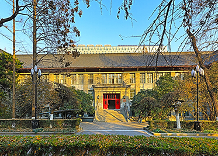

同西南楼。

现为医学院院楼。

## **16. 中山楼**

年代：1912年

类别：近现代重要史迹及代表性建筑/市县级

中山楼建于1912年，位于鼓楼校区南园，其占地面积约180㎡，建筑面积约350㎡，是一幢西式风格的别墅。该建筑高为两层，上有老虎窗，坐北朝南，灰色墙面，红色屋顶，砖混结构。一楼有柱式外置门廊，二楼有简易阳台，房顶有三个并排而立的老虎窗，其外表为红色，煞是引人注目。

其第一任住户为金陵大学教师Amasa Archibald Bullock（1876-1950），Bullock先生离职后，另一位美国教师胡默尔（William Fredericj Hummel）一家入住。胡默尔先生因南京事件离开南京后，时任金陵大学工程处主管的齐兆昌、校长李方训陆续在此居住过。此后这栋建筑相继作为商学院、财务处、学工处办公场所使用。据说，孙中山辞去临时大总统职务后，一度居于此地，得名中山楼。

现空置。

## **17. 金陵大学旗杆**

年代：1935年

类别：近现代重要史迹及代表性建筑/市县级

金陵大学旗杆坐落在鼓楼校区北园名为大纛坪的小广场内。1934年9月与金陵大学仅一墙之隔的日本驻华公使馆竖起一根钢架式旗杆，悬挂太阳旗，金陵大学师生义愤填膺，自动筹款，于1935年8月耗资1700元的钢管式旗杆在学校礼拜堂南侧落成。旗杆高40余米，高高飘扬的国旗超出了与之毗邻的太阳旗，以示中国人民不可侮。

旗杆已修缮完成。

## **18. 健忠楼**
年代：1915-1916年

类别：近现代重要史迹及代表性建筑/市县级

该楼建于1915-1916年，现为“鼓楼区一般不可移动文物”和“南京市重要近现代建筑”。原门牌号为平仓巷4号，是一座砖木混合结构的坡屋顶建筑，含阁楼层和地下室共四层，总建筑面积约为700㎡。建筑外立面现为2000年左右改造的青砖贴面，屋面大部分保留了最初的鱼鳞瓦（水泥瓦），屋顶南北侧均设有老虎窗；平面基本呈“L”型，主入口位于建筑北侧。原用途查不详，因香港晓阳慈善基金会林健忠先生捐资修缮，而冠名“健忠楼”。

现为南京大学体育部办公楼，正在修缮中。

## **19. 罗根泽旧居**
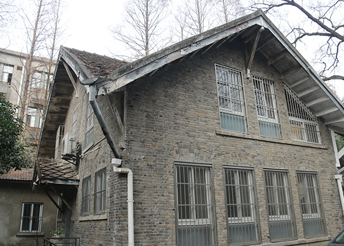

年代：民国

类别：近现代重要史迹及代表性建筑/市县级

罗根泽旧居位于南京大学北园南侧，该建筑坐东朝西，地下一层，地上二层，建有阁楼，砖木结构，西式风格，占地面积约95平方米建筑面积282平方米。该建筑系当代著名学者和文学评论家罗根泽的旧居，现为南京大学装备处办公楼（？）。 

## **20. 李四光工作室**
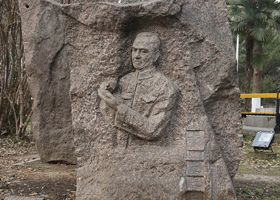

别名：小红楼

年代：民国

类别：近现代重要史迹及代表性建筑/市县级

李四光工作室位于鼓楼校区北园西南角，建于民国年间，为独立式楼房，地上二层带阁楼，地下一层，坐西朝东，正门前有石台阶，占地面积150㎡，建筑面积420㎡。该建筑原为著名地质学家李四光在南京工作的工作室，产权系南京市房产局，由南京大学代管。

现归属艺术学院美术系。

## **21. 慈氏图书馆**
## **22. 天文观测楼**
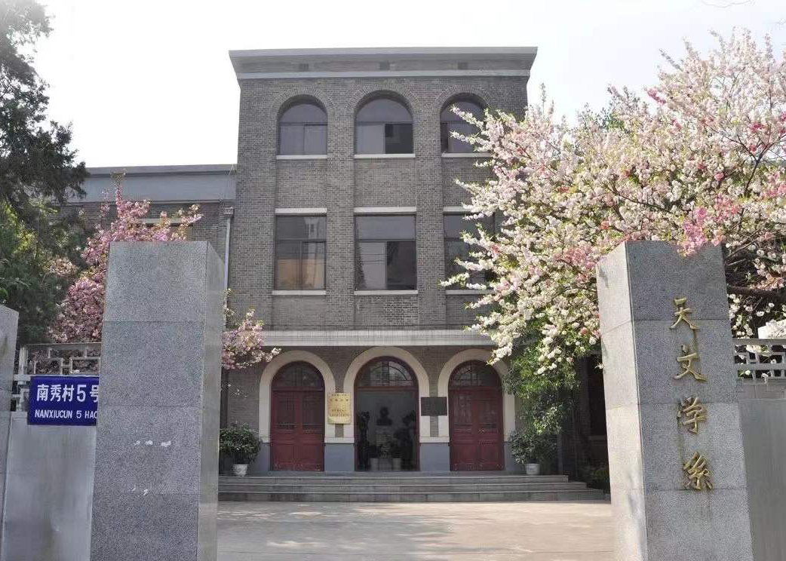

年代：1955年

类别：近现代重要史迹及代表性建筑/市县级

天文观测楼位于南大北苑西大门外南秀村5号，该建筑坐南朝北，中式建筑，高三层，砖混结构，大门呈拱形状，中门稍大，两侧门对称。中门上端建有三层圆形天文观测台，三层顶上呈银色球形状。该建筑建于1955年，占地面积约500平方米，建筑面积1233平方米。

曾作为天文系系馆使用，现空置。

## **23. 陶园南楼**
别名：桃园南楼，汉口路9号民国建筑

年代：1933年

类别：近现代重要史迹及代表性建筑/市县级

陶园南楼，始建于1933年。建筑共2层，坐东朝西。部为城砖，上面为青砖，屋顶正中有一特殊造型，风格为大屋顶宫廷式建筑，气势宏伟。最初归属农学院使用。后曾作为女生宿舍、教职工宿舍。2009年被列为南京重要近现代建筑。

现为女生宿舍。

## **24. 南苑宾馆**
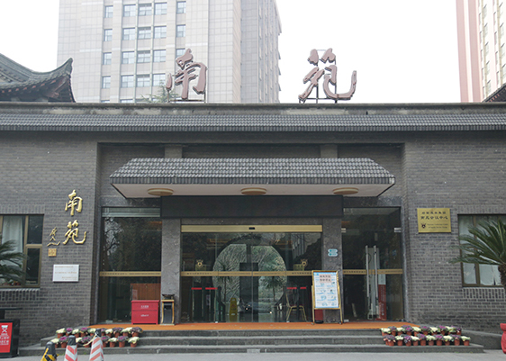

别名：南苑会议中心

年代：1954年

类别：近现代重要史迹及代表性建筑/市县级

南苑宾馆位于鼓楼校区南园西南侧，建于1954年，占地面积1305平方米，建筑面积3914平方米，两幢建筑均坐南朝北，高三层，砖木结构，大屋顶，仿宫殿式建筑。

现在的南苑宾馆是在这两栋大屋顶建筑基础上于1992年改造而成的，2002年进行了简单内部装修，作为南京大学对外服务的窗口及接待中心经营服务的主要部门。

现作为宾馆和餐厅对外营业。

## **25. 南园八舍**
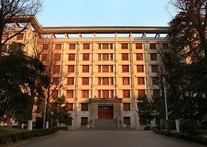

别名：八舍

年代：1955年

类别：近现代重要史迹及代表性建筑/市县级

南园学生宿舍楼简称八舍，位于鼓楼校区南园南侧，广州路大门正中处。建于1955年，坐北朝南，高八层，中西合璧式风格，混合结构，建筑面积12330平方米，占地面积1542平方米。1995年左右发现建筑沉降不均，被定为危房。于是拆除过重的大屋顶，加固外墙，加2层，共7层。

八舍一直作为女生宿舍使用，曾一度是华东地区最大的女生宿舍楼。现仍为女生宿舍。

## **26. 陈裕光旧居**
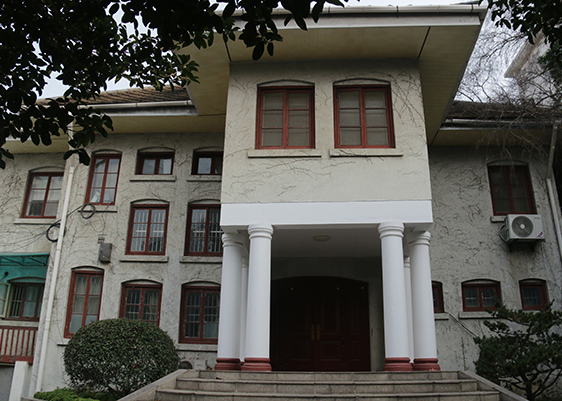

年代：1920年

类别：近现代重要史迹及建筑/省级 (批次:7)

陈裕光旧居始建于1920年，由陈裕光的父亲陈列明所建，1941年以后归陈裕光所有。解放后，该建筑曾为南京大学校长匡亚明、曲钦岳等人所居。1989年，陈裕光去世后，该建筑房产权归其子女所有。1995年7月12日，该房产捐赠爱德基金会所有。翌年，该建筑经过修整后，为爱德基金会使用。现保护状况较好。

该建筑坐南朝北，大门向东，西式风格，砖混结构，楼高三层，另有地下室一层，计有房24间。

陈裕光（1893-1989），号景唐，1893年3月7日生于南京。祖籍浙江省宁波，随父迁家南京，1905年入南京汇文书院附中求学。1911年入南京金陵大学化学系。1922年夏后，曾任北京师范大学教务长、化学系主任，主讲有机化学，兼学校评议会主席，并主持编译柯威和史罗荪的《科学与世界改造》，他还曾两次担任代理校长职务。

## **27. 冈村宁次旧居**
年代：民国

类别：近现代重要史迹及代表性建筑/市县级

位于金银街2号、4号，有两幢花园式别墅，这就是日本战犯冈村宁次曾经居住过的寓所。现为南京大学教职工宿舍。冈村宁次是侵华日军中最重要的战争罪犯之一，他的全部军人生涯几乎都与中国有关。1944年11月升任侵华日军的最高头目——日本驻中国派遣军总司令官。1945年8月15日，日本宣布投降。9月9日上午9时，民国政府在国防部举行了日军投降签字仪式，冈村宁次代表日本政府在投降书上画押签字。1946年12月6日，冈村宁次搬入原日本大使馆租借的金银街4号。他在这里度过了一段惶恐不安的生活，直到1948年3月29日，他才在两名国民党军官的陪同下悄然离开南京。1949年1月30日，冈村宁次与其他战犯一起被遣送回国。

## 28.曾宪梓楼（海外教育学院院楼）
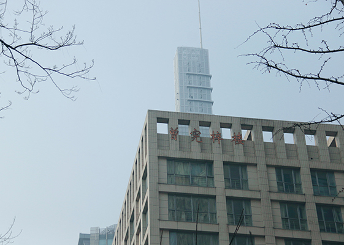

位于鼓楼校区北园西北方向，金银街以北。2007年，曾宪梓先生慷慨捐建海外教育学院，助力我校留学生培养工作。

## 29.安中楼（商学院院楼）
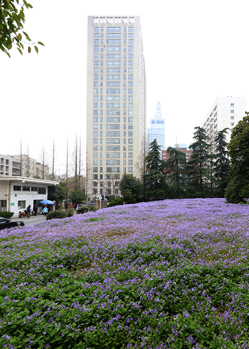

2007年落成使用。为感谢香港荣华纺织有限公司董事长、苏浙同乡会名誉会长赵安中先生的捐资助建的善心义举，学校将该楼命名为“安中楼”。

## 30.化学楼
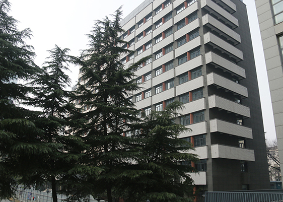

位于北园西北角，老化学楼，现为医学院、分子中心等院系单位实验室使用。

## 31.费彝民楼
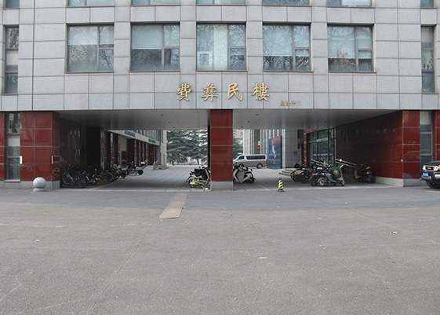

2008年正式启用。为感谢费彝民先生的捐赠命名。

## 32.南京大学出版社楼
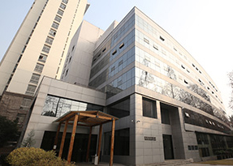

靠近老化学楼。

## 33.中国思想家研究中心
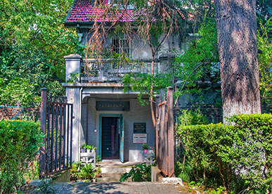

靠近金银街。

## 34.中华文化研究院
田家炳艺术馆附近，现办公地点为仙林校区星云楼。

## 35.物理楼
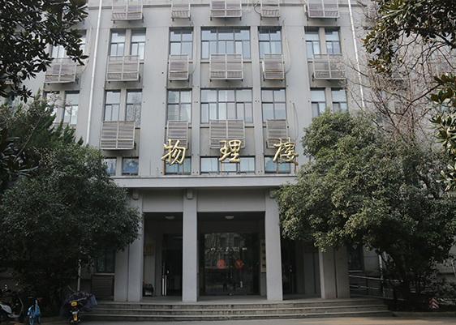

物理学院院楼，临近汉口路正门，中大路以西，图书馆对面。建于1973年。

## 36.中美文化研究中心
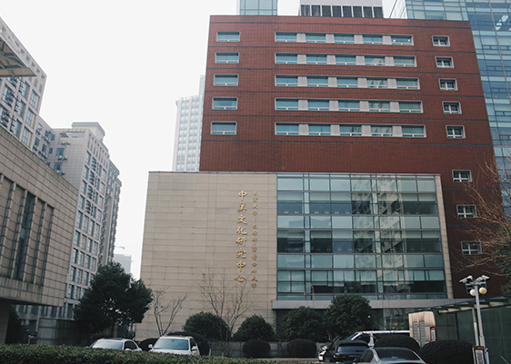

位于西北角，1986年开始招生。

## 37.科学楼
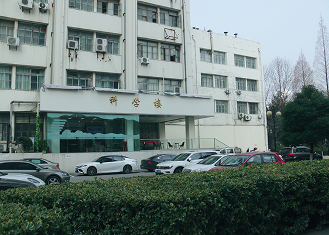

1987年投入使用，曾为环境学院行政楼。

## 38.唐仲英楼
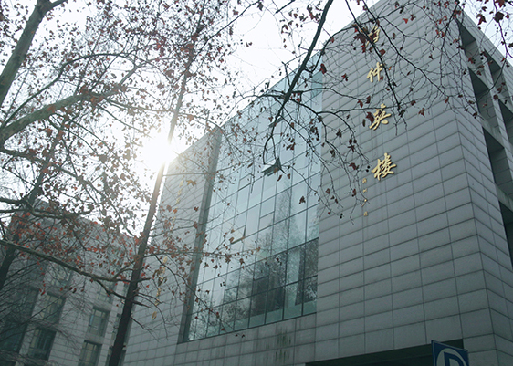

位于北园西北侧，南京微结构国家实验室（筹），2008年竣工，为感谢唐仲英先生及其基金会的善心义举，学校将该楼命名为“唐仲英楼“。

## 39.工程管理学院
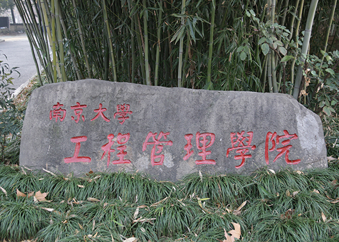

西北门外，园林式庭院，原陈裕光先生居所。

## 40.南园喷泉小广场
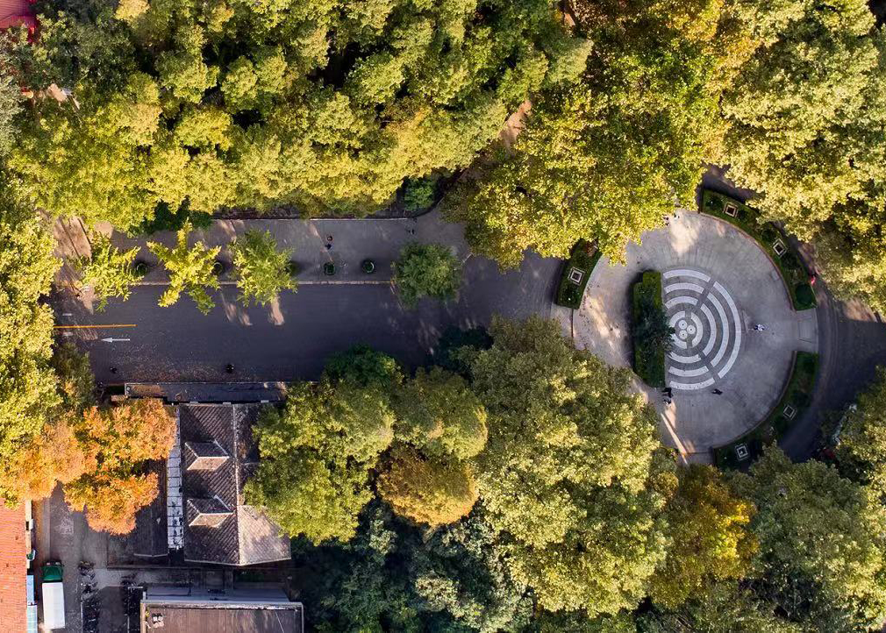

## 41.戴安邦、高济宇旧居
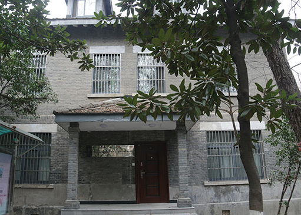

位于南园南部，1912年建成，二层砖木结构。

## 42.郑钢楼
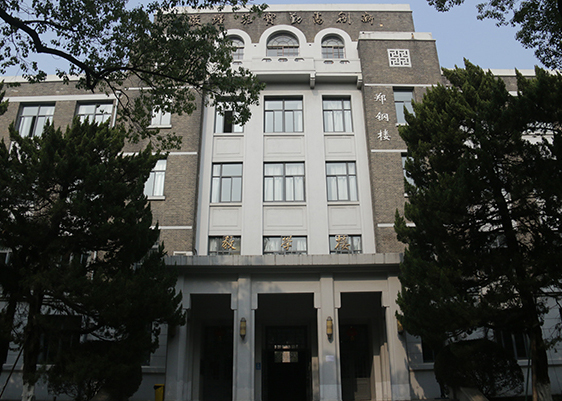

教学楼，位于北园中轴线中心点，建于1964年，郑钢先生捐资建设。

## 43.五二零纪念亭
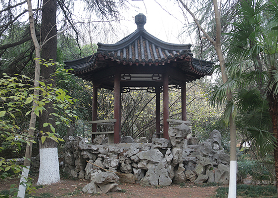

位于北园金陵大学旧址中，为纪念”五二〇“爱国学生运动设立。

## 44.科学技术馆
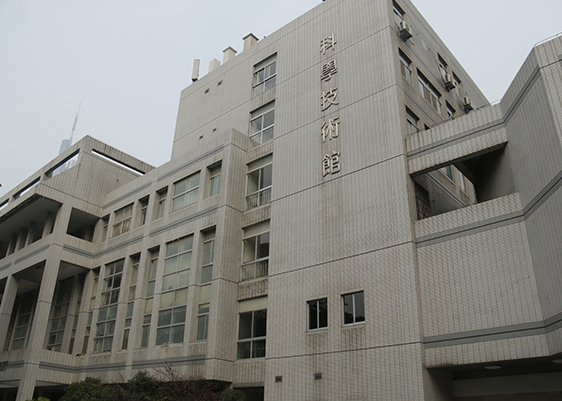

位于南高路，1999年建成。

## 45.蒙民伟楼
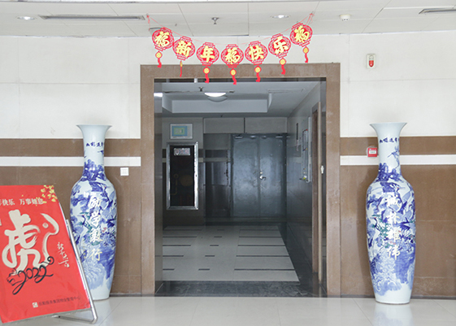

位于北园东南角，大楼高耸。为感谢蒙民伟先生及香港信兴集团捐资助建的善心义举特此命名。

## 46.校医院
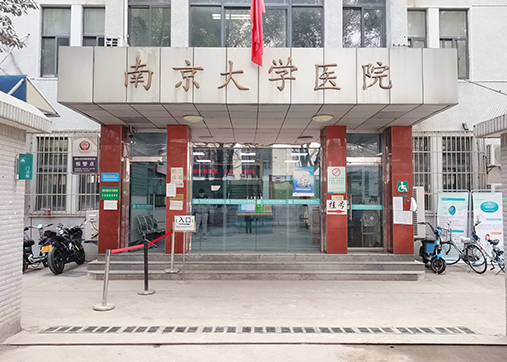

1978年成立，1996年被评为一级甲等医院。

## 47.广州路校门
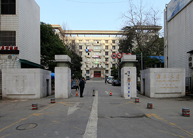

## 49.鼓楼大活|耀良楼
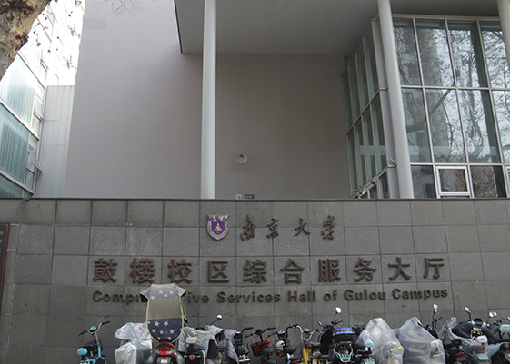

2003年建成，铭刻杨丹校友慷慨捐资助学之举、不忘父恩之情命名。

## 50.南园教学楼（终身教育学院院楼）
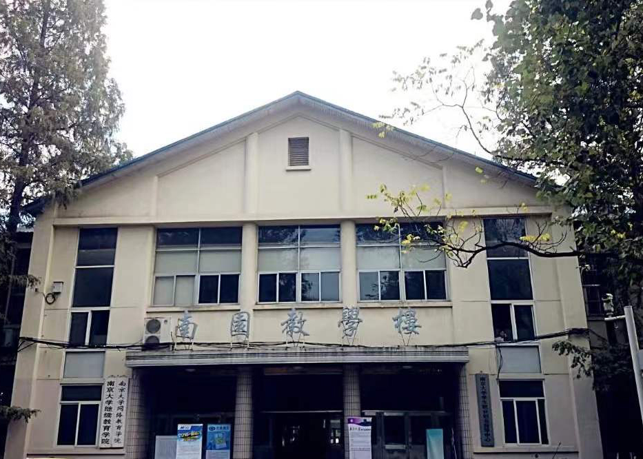

## 51.有园宾馆
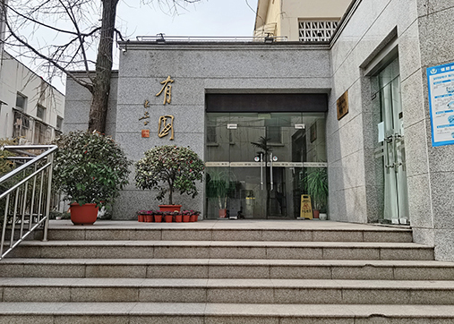

建于1984年。

## 52.松林楼（财务处）
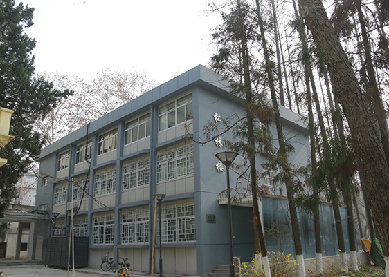

南园正门东侧，三层砖混结构，中山楼旁边。

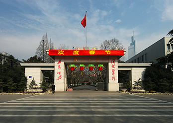

## **参考文献**
[1] 华夏古迹图 [https://www.sinorelic.com/map](https://www.sinorelic.com/map)

[2] 江苏省不可移动文物数据库 [http://www2.jslib.org.cn/was5/web/unmovable2015.htm](http://www2.jslib.org.cn/was5/web/unmovable2015.htm)

[3] 冷天,赵辰.原金陵大学老校园建筑考[J].东南文化,2003(03):53-58.

[4] 冷天.金陵大学校园空间形态及历史建筑解析[J].建筑学报,2010(02):22-25.

[5] 王瑜. 南京大学鼓楼校区文怀恩故居砖墙砌筑特征研究[D].南京大学,2020.

[6] 韩书园. 基于胡默尔家族档案的“中山楼”历史研究[D].南京大学,2017.

[7]南京大学VR云游览[https://vr.nju.edu.cn/#/](https://vr.nju.edu.cn/#/)

[8]南京大学档案馆[https://dawww.nju.edu.cn/sy.htm](https://dawww.nju.edu.cn/sy.htm)

---

[南哪助手长期接受同学们投稿](https://www.yuque.com/greatnju/q-a/gw3phd#k6p5Y)

