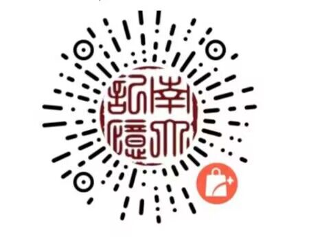

南京大学2023级新生可根据自愿原则委托学校后勤服务集团教育v超市免费代购。

请注意，**只是代购不额外收费，并非卧具免费**。

全套物品包含床上用品和生活必需品等共计**16**件，新生可提前选择定购。

教育超市的套装**总计480元**，需要提前定购，其中包含了：

**棉盖胎+布盖*1，中空棉盖胎*1，床垫*1，被套*2，床单*2，枕套*2，蚊帐*1，枕芯*1，竹席*1，蔺草枕席*1，帐钩*2，牛津包*1，开水瓶*1，塑料盆*2，杯子*1**

质量一般，可以正常使用。

详细图片及信息可参考官方小程序“**南大记忆**”（[#小程序://南大记忆/u4nLwiyRQxGUnru](#小程序://南大记忆/u4nLwiyRQxGUnru)）

直接扫描下图二维码也可进入，这也是预定新生卧具的唯一途径，

开学当天可以在南京大学鼓楼校区领取【截止7.30，具体领取地点待定】。

***此产品为预售产品，不进行物流发货**

*******下单请务必备注学生姓名、学号、可联系到学生本人的手机号**

详细信息也可参考小程序内部文字图片解释及《南京大学2023年新生入学指南》P4

