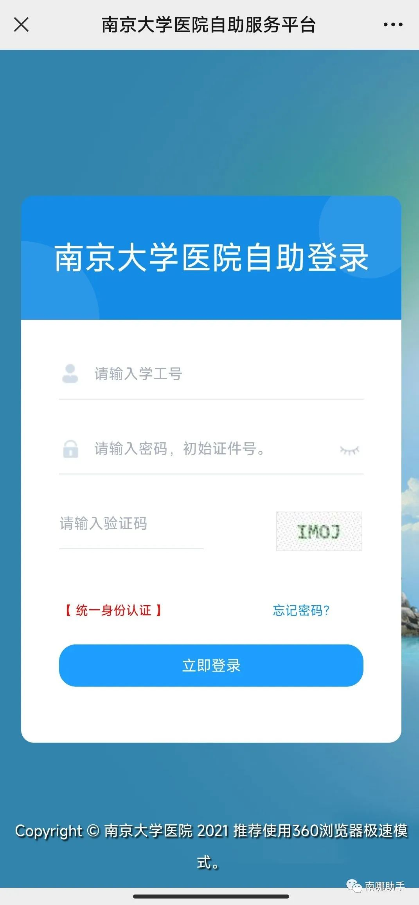
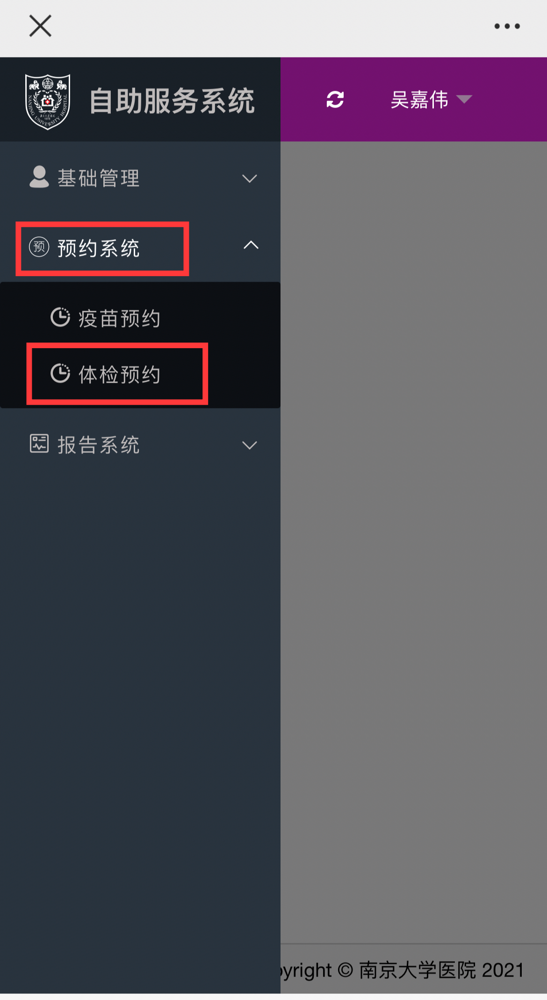
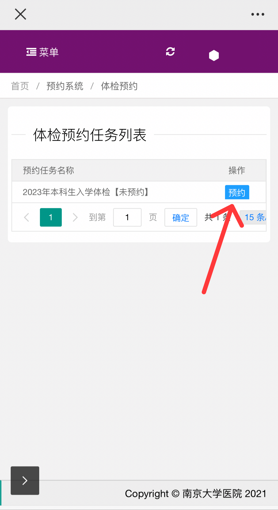
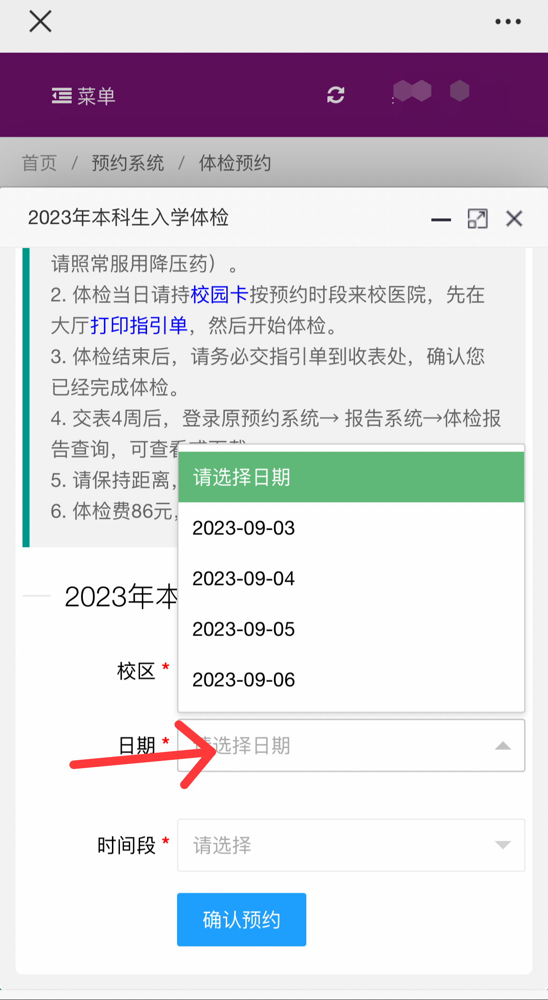
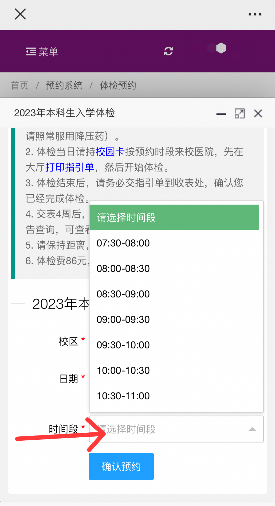
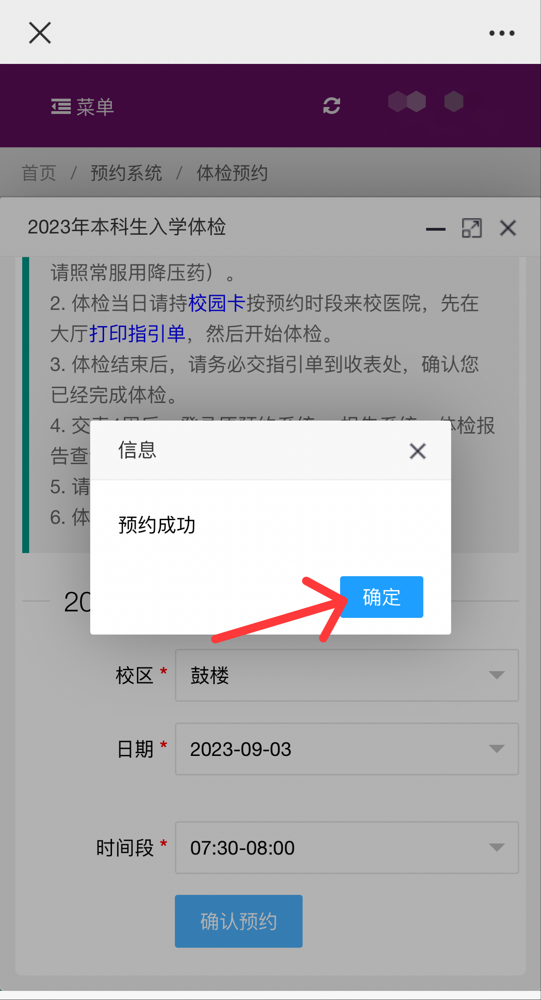
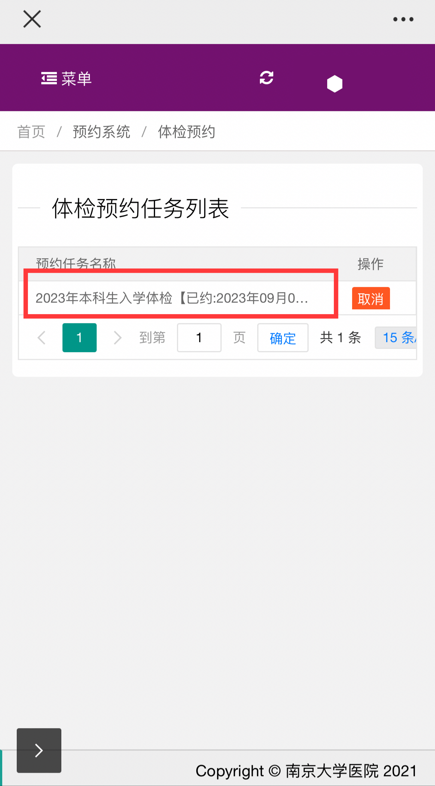
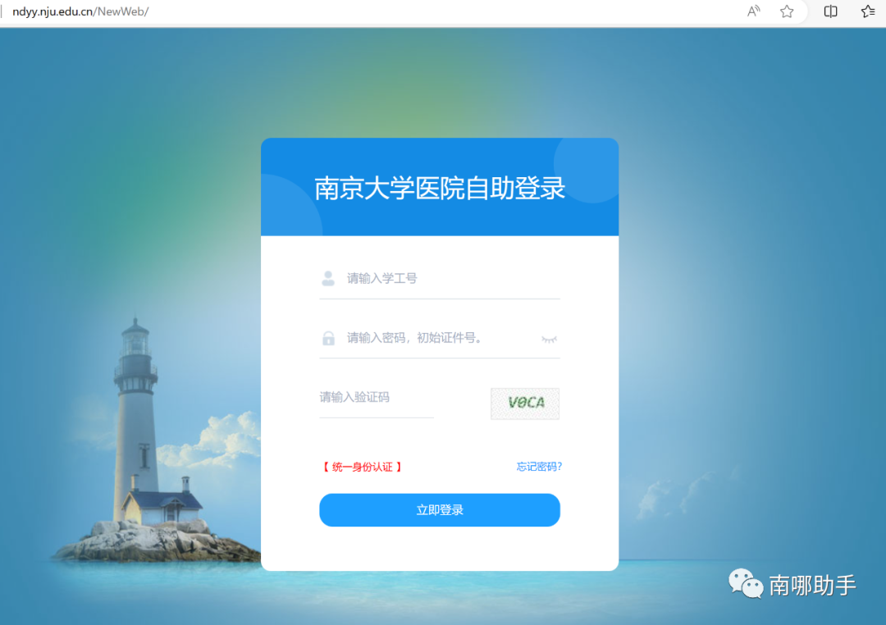
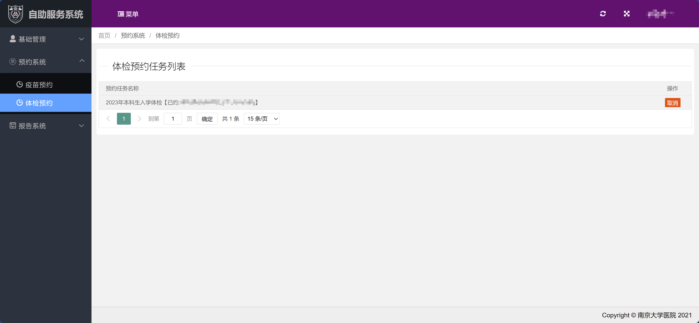
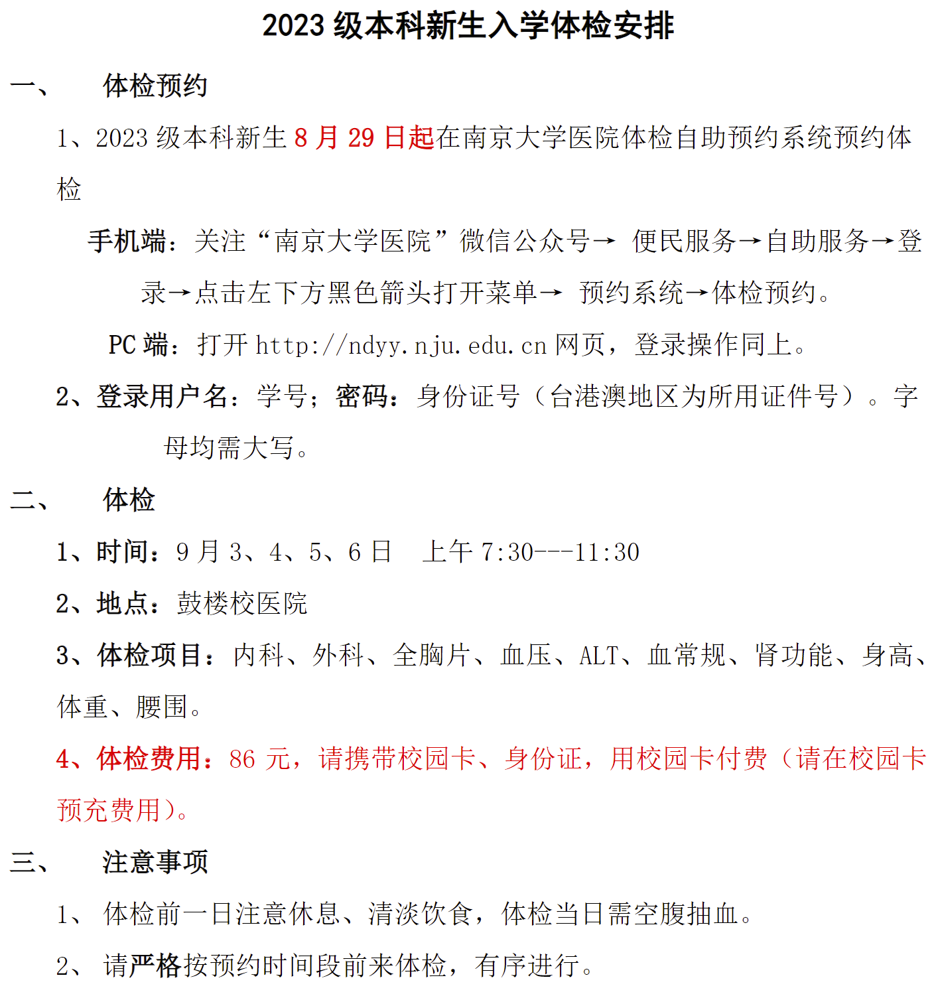

# **一、体检预约**
1、2023级本科新生**8月29日**起在南京大学医院体检自助预约系统预约体检。（**注：**所以在这之前登录不上校医院**是正常的！**到时间就可以登录了！）

## **手机端：**
（1）关注**“南京大学医院”**微信公众号：

（2）便民服务→自助服务→登录→点击左下方黑色箭头打开菜单→预约系统→体检预约。  

  

## **PC端:**
打开**http://ndyy.nju.edu.cn**网页，登录操作同上。

[南京大学医院自助登录](http://ndyy.nju.edu.cn/)

2.登录用户名：**学号**；密码：**身份证号**（台港澳地区为所用证件号）。字母均需大写。

3.其余操作同手机端

4.预约成功画面：

  

# **二、体检**
## **1.时间：**
9月3、4、5、6日

上午7:30——11:30

## **2.地点：**
鼓楼校医院

[amap](https://ditu.amap.com/place/B001906FML)

## **3.体检项目：**
内科、外科、全胸片、血压、ALT、血常规、肾功能、身高、体重、腰围。

## **4.体检费用：**
:::danger
86元，请携带校园卡、身份证，**用校园卡付费**（请在校园卡预充费用)（如果你不知道什么是校园卡，可以阅读助手往期推送：

:::

[迎新特辑07丨校园卡的正确使用姿势（本研通用）](http://mp.weixin.qq.com/s?__biz=MzkxNDMxNTU5Nw==&mid=2247494740&idx=1&sn=249249c87be61cf9d0b31f62ac911fca&chksm=c172ec76f6056560ccfd1c9644c36c972b9d7239ae70135241bb2dd503a69aafa99db4618fd1&scene=21#wechat_redirect)

  

# **三、注意事项**
:::info
1、体检前一日注意休息、清淡饮食，体检当日需空腹抽血

:::

:::info
2、请严格按预约时间段前来体检，有序进行。

:::

源文件指路：

[南京大学迎新网 通知公告](https://admission.nju.edu.cn//tzgg/20230825/i249830.html)

# **四、注明**
**注：****研究生**新生入学体检安排请耐心**等待学校后续通知！**

**本文来源：**

**南哪助手**微信公众号

[​迎新特辑19丨2023级本科新生入学体检安排来了！](https://mp.weixin.qq.com/s/BEGRBPG1oPt8ba4S2GBS8w)

  
**另注：**

随着录取工作的进行，部分同学已经成了南京大学的准新生，**【南哪2023级本科新生咨询QQ群②】（群号865543579）**也如约而至了！

详细的资料、专业的态度、热心的学长学姐，这里都有！

学生咨询交流群面向的是学生，**谢绝家长入群！**

南哪本科新生咨询群是小破手搭建的平台，连接新生和热心老生，解答新生的各类问题，帮助新生更快适应南大的学习生活。新生可以在这里询问任何与大学生活相关的事情，会有热心的学长学姐（都经过严格的身份核实）及时答疑。顺便强调一下，卖卡卖课卖被子等一切商业推销行为均属于本群红线，**有这个想法的请远离！！**

