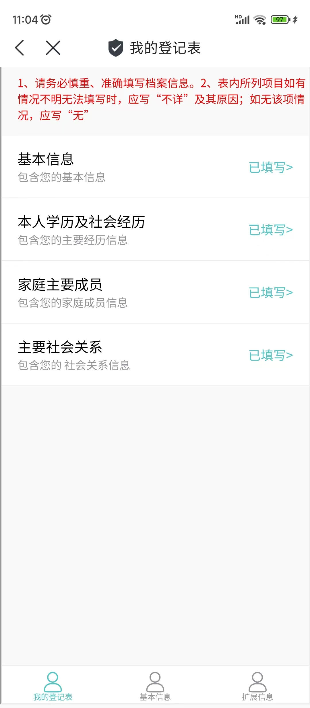
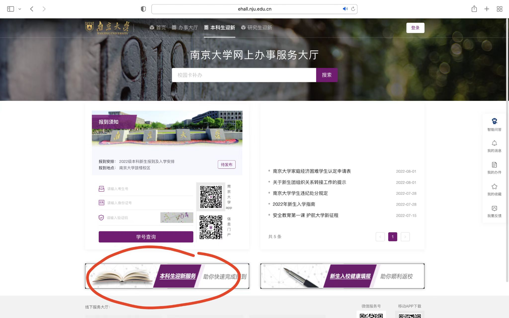
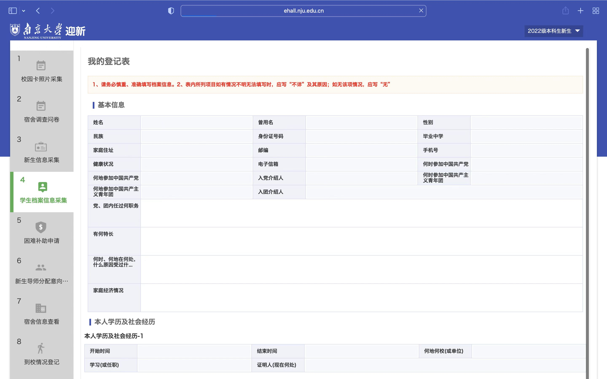

当啷啷！当啷啷！走一走看一看啦！走过路过不要错过呀！

亲爱的南哪2023级本科新生们：

你们的新生登记表填写了吗？

本模块是非常重要的，在报道后需要打印存档，所以请一定要尽快认真填写哦！

南京大学2023级新生学生登记表填写都是通过迎新系统（[admission.nju.edu.cn](https://admission.nju.edu.cn)）进行的，该系统有两种进入方式。

1.南京大学APP-本科生迎新服务-档案信息采集

2.登陆南京大学迎新网（[admission.nju.edu.cn](https://admission.nju.edu.cn)）-本科生迎新服务-学生档案信息采集

其中，登陆账号为学号（查询方式详见[南哪2023新生学号查询方式](https://www.yuque.com/greatnju/memory/xnmugu)），初始密码为身份证全部（如过更改过，密码则就是更改后的）。

值得注意的是，需要填写的栏目之一“主要社会关系”一般指本人家庭成员以外的旁系亲属关系，即除共同生活的父母、配偶和子女以外的主要社会关系。

“家庭主要成员”填写配偶（没有配偶的忽略，男女朋友不算配偶）、父母、子女情况；

“主要社会关系”填写岳父母、公婆、兄弟姐妹、伯、叔、姑、舅、姨等。

温馨提示：

同时太多人登录容易造成服务器崩溃，所以如果点进去白屏不要着急，稍等后会恢复。

