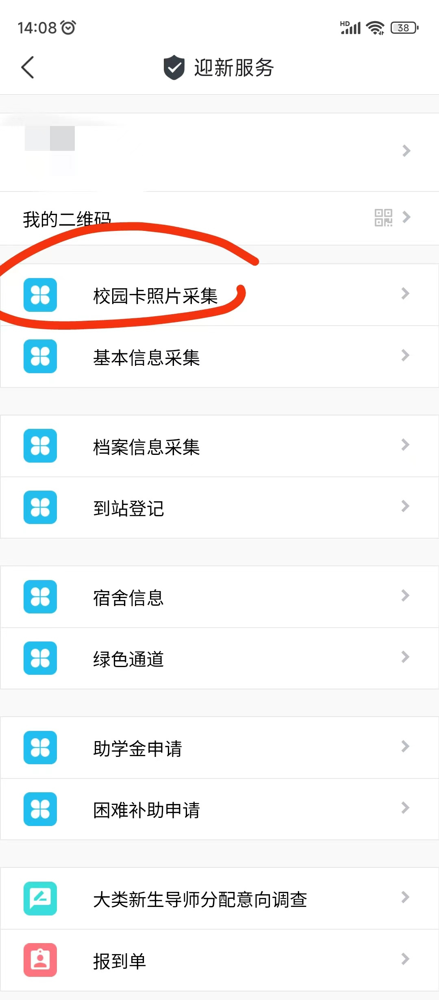
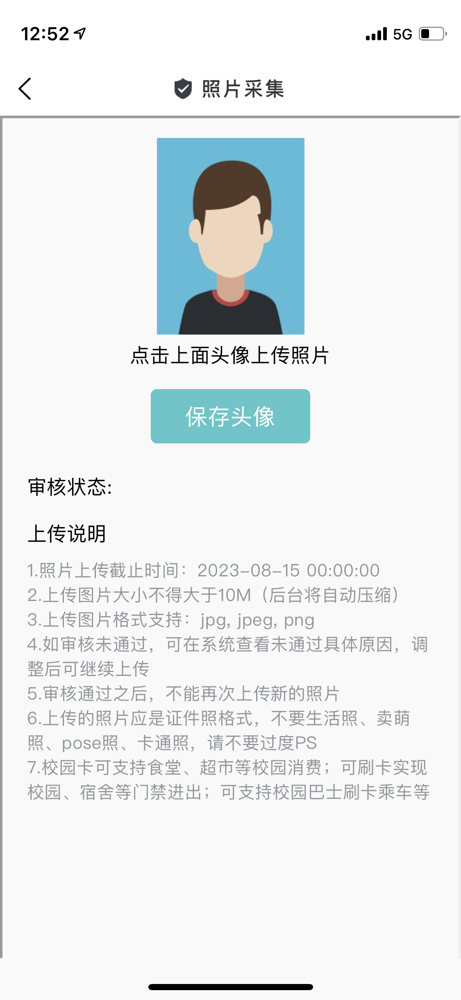
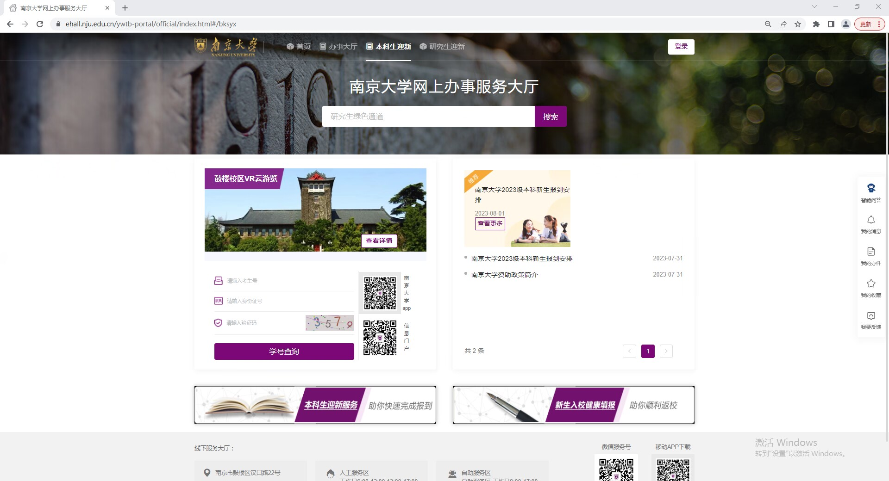
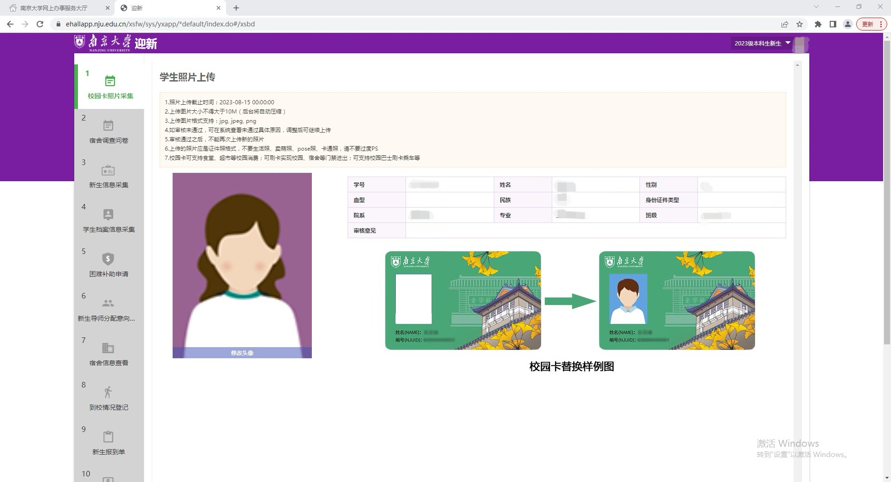

南京大学2023级新生校园卡照片采集都是通过迎新系统（[admission.nju.edu.cn](https://admission.nju.edu.cn)）进行的，该系统有两种进入方式。

1.南京大学APP-本科生迎新服务-校园卡照片采集

2.登陆南京大学迎新网（[admission.nju.edu.cn](https://admission.nju.edu.cn)）-本科生迎新服务-校园卡照片采集

其中，登陆账号为学号（查询方式详见[<u>南哪2023新生学号查询方式</u>](https://www.yuque.com/greatnju/q-a/xnmugu)），初始密码为身份证全部（如过更改过，密码则就是更改后的）。

值得注意的是，如果不更改，校园卡上的照片则默认为高考准考证上的照片。

温馨提示：

1.因录取进度不同，部分同学的信息还未录入，所以确定账号密码输入无误但登录不了不要

急，等一段时间就可以了。

2.因同时太多人登录容易造成服务器崩溃，所以如果点进去白屏不要着急，稍等后会恢复。

