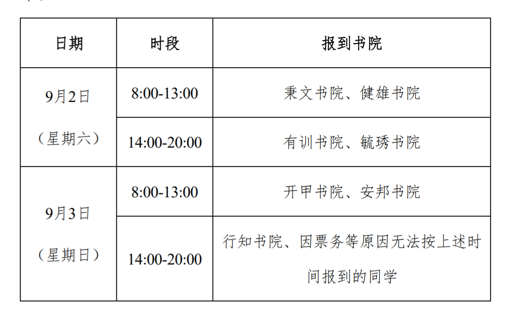

今年23级本科新生将错峰进行报到，因鼓楼校区地处南京市中心，交通空间等条件受限，特制定南京大学2023级本科新生各书院报到安排，具体安排如下：

大家需要按照规定时间报到，合理安排行程，有任何问题请及时和辅导员联系。

温馨提示：南京大学鼓楼校区地处南京市中心，周边路况复杂，极易引发交通拥堵，根据交管部门要求，请尽量避免自驾车辆到校报到，大家最好乘坐公共交通工具自行报到，学校将在南京南站、南京站设接待点，并做好迎新志愿服务工作。

小破手期待在鼓楼校区与大家相遇～

来源：迎新网[https://admission.nju.edu.cn//tzgg/20230731/i249438.html](https://admission.nju.edu.cn//tzgg/20230731/i249438.html)

