[南哪助手长期接受同学们投稿](https://www.yuque.com/greatnju/q-a/gw3phd#o8osi)

---

#### 最后更新时间：2025.04.09
#### 建议有问题先在语雀文档内搜索，得不到解答再在咨询群中提问题~
#### 如有发现本问答中有过时/已经失效的答案或有某方面的最新通知，欢迎向南哪助手反馈/投稿~
## 入学之前
#### Q：大一新生在哪个校区就读？学校有几个校区？
A：大一新生第一年均在**鼓楼校区**就读**。**南京大学总共有四个校区：鼓楼校区、仙林校区、苏州校区、浦口校区。

#### Q：大二搬校区？
A：除南赫和技术科学试验班搬迁至苏州校区外，其余专业均搬迁至仙林校区，其中医学、软工、建规和物理等在大三大四**可能**会再度搬迁回鼓楼，具体以当时学院政策为准。

#### Q：学校的新生入学指南怎么查看啊？ 
A：一般来说，录取通知书中有一张卡片，可以自行扫码下载。**请仔细阅读新生入学指南的内容，并按照其中相关要求进行操作。**

扫码链接：[南京大学2024年新生入学指南](https://box.nju.edu.cn/d/61af39e9a6e849dd868d/)，**<u>已经发布！</u>**

[南京大学2024年新生入学指南.pdf](https://www.yuque.com/attachments/yuque/0/2025/pdf/34810676/1746452057543-cf4f1638-3176-418f-a2d4-539cd255060d.pdf)

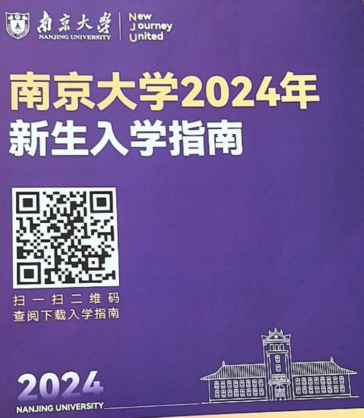

#### Q：有官方的本科新生群或者通知群吗？ 
书院**官方群**已发布，**务必及时加！**没通过也**不用着急**，有的辅导员到了开学前集中处理入群申请，可以在咨询群关注一下同书院同学的情况。

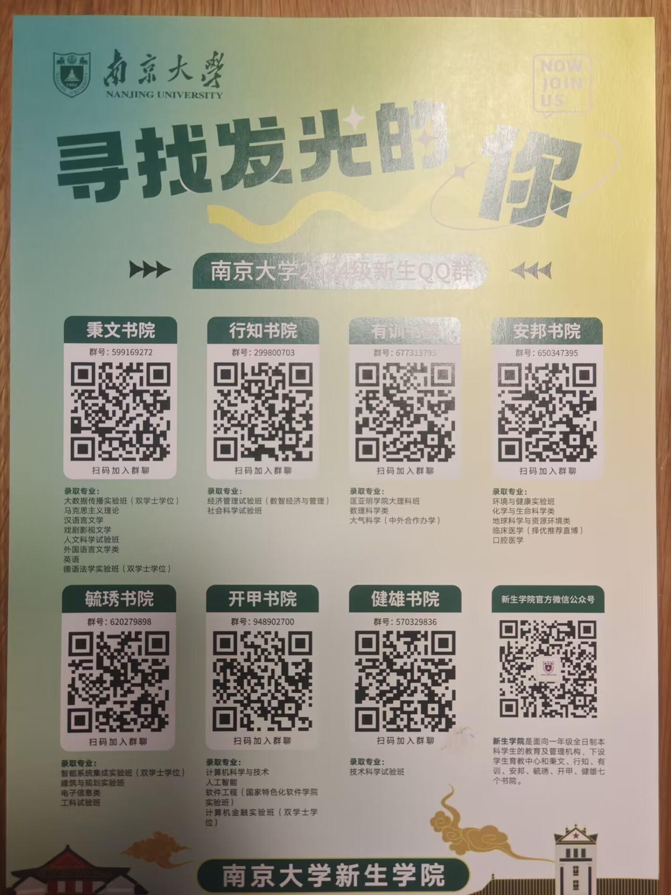

#### Q：本科新生开学时间？报道后军训前的时间干什么？
A：**8月24日到8月25日。**为了控制人流，不同书院错峰报道。错峰报道安排如下：

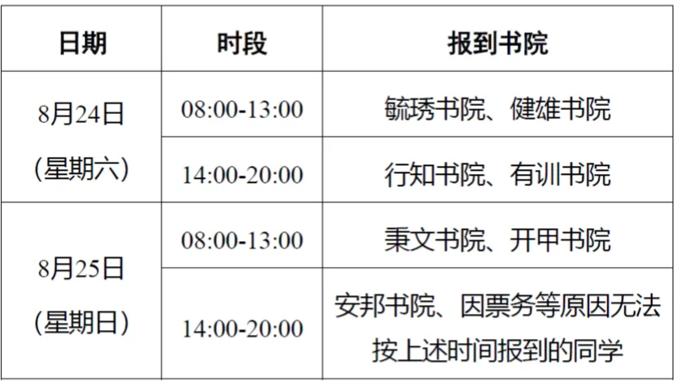

错峰报道安排通知原文如下：

[南京大学2024级本科新生错峰报到安排.pdf](https://www.yuque.com/attachments/yuque/0/2025/pdf/34810676/1746452057757-75113c6d-2741-447d-88d4-7c7212ebed14.pdf)

大家可以在加入官方书院群后，耐心等待辅导员发布关于具体报道情况的后续通知，无需着急。**报道后军训前的安排以学校/书院辅导员通知为准。**这次本科新生需要提前到校军训，目前具体军训时间拟定于**2024年8月28日至9月16日，实际情况请以学校/书院辅导员通知为准**。

具体通知如下，**特别提醒**：以下链接那个地点在仙林校区意思是针对补训同学，新生应该还是在鼓楼校区军训，一切以最终官方通知为准：

[2024年本科生军事技能训练通知](https://jw.nju.edu.cn/a6/96/c26263a698006/page.htm)

#### Q：本科新生缴费？
A： 按照入学指南，24级新生需在~~**8月16日前**~~**（按财务处最新通知为8月18日前）**将应缴的学杂费存入或汇入“牡丹灵通卡”——即**随通知书寄来的工商银行卡**，并确保实际存款额不低于学杂费之和，银行方能成功扣款，**统一扣款时间****为8月19日**。（也就是说8月16日之后**不会立即扣费**，不要在8月16日刚过就问为什么没扣费，**请学会等待**）

对于**未在8 月 18 日前按时存入资金或批量扣款未成功的同学**，请于**8 月 21 日**起通过**自助缴费方式**进行补缴，以免影响报到注册。**自助缴费**流程详见下方**南京大学财务处微信公众号推文。**

[财务缴费指南，助您便捷缴纳学费](https://mp.weixin.qq.com/s/_1H2L1Tej8sgPwS4TJWLEw)

已申请办理助学贷款的同学可暂不存入资金，以避免被扣缴学费，但请务必根据报到当日现场安排缴纳代收费（教材费、大学生医保费）。

** 新生学杂费缴费通知详情**见下文：

[【关于2024 级本科新生学杂费缴费的通知】南京大学迎新网 通知公告](https://admission.nju.edu.cn//tzgg/20240812/i272972.html)

> 注：因特殊原因未开卡成功的同学会在通知书内收到相关情况说明，请按照其内容进行操作，可以先关注财务处通知，开学时线下办理南京大学联名卡或通过其他方式，进行缴费； 办理助学贷款的同学可暂不存入学杂费，但请务必在报到当日前往收费点交纳代收费（教材费、大学生医保）  
>
> 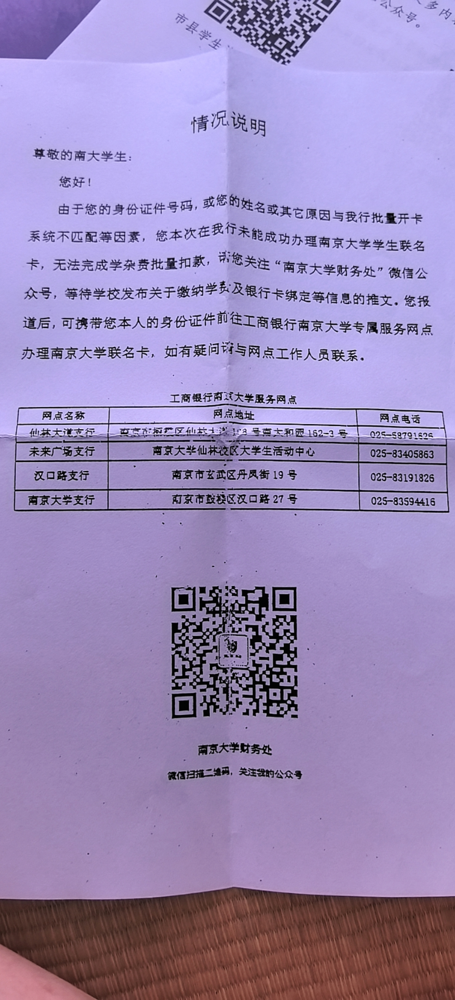
>

**学费计算**： 住宿费 **1500 **元 / 生·学年；教材预收款** 500 **元 / 生； 大学生医保** 230 **元 / 生·学年，医保费按学制在入学时一次性收取（若学制为 4 年，则收 920 元）。住宿费和专业学费每年收费，教材费只收新生开学一次，多退少补，具体各专业学费请查询**新生入学指南P5/6**——《 南京大学 2024 级学生学费标准 》，这里以社会科学试验班举例：

需存入金额为住宿费1500+教材500+医保920+学费5720=8640元

> 住宿费在不知道宿舍分配的情况下，以最高1500元计算
>

#### Q：学号怎么知道啊？
A：**本科招生网录取查询模块**（网址： **bkzs.nju.edu.cn**）可以查。

**特别提醒**：考生号非港澳台等特殊情况下，均为**24+两位省份代码开头的****14****位数字**。

<strong>考生号/准考证号非14位的情况/省份</strong>
<ul class="ne-ul"><li id="u5bc34074" data-lake-index-type="0">陕西：2461 + 准考证号10位</li><li id="uad6a098e" data-lake-index-type="0">湖南：2443 + 考生号10位（不是包含字母的准考证号）</li><li id="ub5164787" data-lake-index-type="0">广东：2444 + 考生号10位</li><li id="uff06dee4" data-lake-index-type="0">云南：去云南高考的报名和志愿填报平台 gk.ynzs.cn 查考生号，2453开头的14位数字</li></ul>
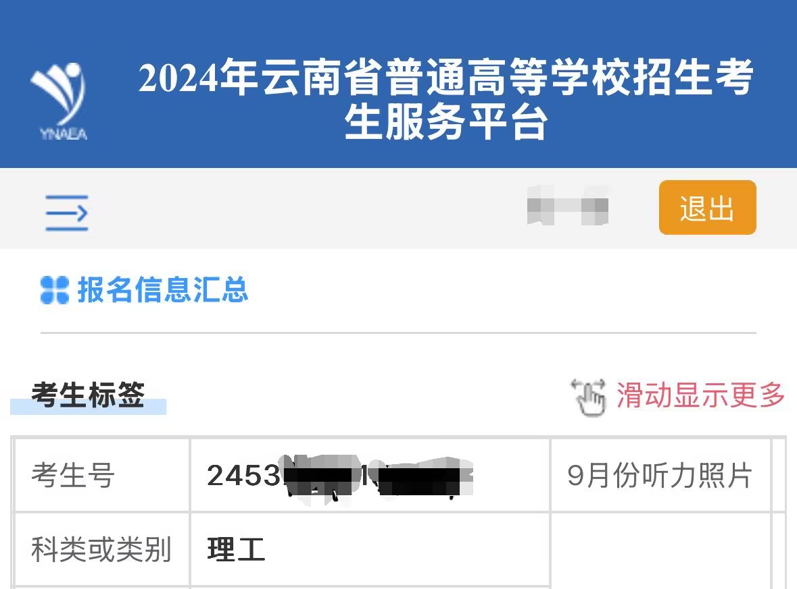

学号前两位24是入学年份，第三位是录取类型，中间三位是大类/专业代码，最后三位是录取时间顺序流水号。另外，录取通知书EMS单号也在[**本科招生网**](https://bkzs.nju.edu.cn/)**录取查询**模块查询。**<u>暂时查不到也别急，应该是还没录入</u>**，录取后两三天内应该能查到。

> 提醒：学工号是**学号**和工号的统称，对于学生而言，**学工号**就是**学号**
>

#### Q：迎新系统\南大APP\统一认证登录？
A：**APP首次使用请使用学工号登录！！！不要手机号注册！！！**

      统一身份认证**用户名是学号，初始密码是身份证号全部。**

如果在网页端统一身份认证登录过且修改过密码，则**APP学工号登录时请使用修改过的密码**——因为APP的学工号登录本质上也是统一身份认证，这是相通的。

另外，南京大学app安装ios请在AppStore中搜索**南京大学****（注意该app只有“南京大学”四个字，并非“南京大学生版”，不要下载错误）**，安卓可以在咨询群群文件中搜索**南京大学**app，或者扫描itsc提供的下载二维码，具体操作见链接：

[南大APP](https://itsc.nju.edu.cn/21607/list.htm)

关于统一身份认证更多问题请看：

[【信息服务】统一身份认证及扫码相关问题（new）](https://itsc.nju.edu.cn/ee/60/c21475a585312/page.htm)

出现如下问题请**退出重登**：

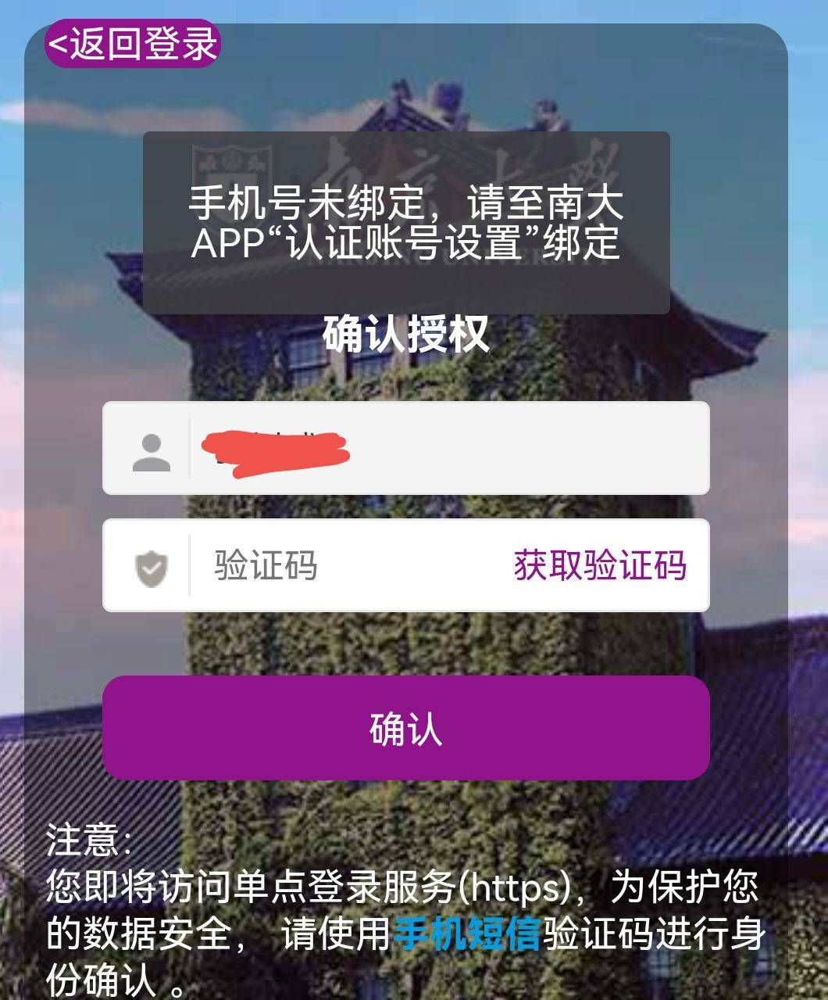

#### Q：电脑推荐？
A：！！！**不推荐**开学前后来鼓楼校区或在老家联系熟人等**一切线下方式**选购电脑，**强烈推荐**提前了解专业需求**线上咨询选购**（官方旗舰店，具体参考下方推送杂谈四），保持主见。

不打游戏可以考虑轻薄本，续航和便携很多时候还是重要的，Mac系统记得询问同专业学长学姐软件适配情况，详细推荐请移步IT侠群887021867或861863787，也可参考下面推送。

[【小白必看】笔记本电脑选购指南](https://mp.weixin.qq.com/s/EvRhVBKdKfvQFM45DP7_Vg)

ps. 电脑拿到手以后设置系统用户名最好避免中文。

itxia**特别提醒**：

[笔记本购买杂谈（一）| 笔记本购前硬件扫盲](https://mp.weixin.qq.com/s/4c3o7z0e2oyuozjoOssbuA)

[笔记本购买杂谈（二）| 买游戏本需要考虑什么？](https://mp.weixin.qq.com/s/xjLcN9GNYW0ftU1bYGj3Ow)

[笔记本购买杂谈（三）| 轻薄本还是全能本？](https://mp.weixin.qq.com/s/IWUUWQMWm_8l-i0ogf4YfA)

[笔记本购买杂谈（四）| 去哪里购买电脑最靠谱](http://mp.weixin.qq.com/s?__biz=MzIxMzAzODE1Mg==&mid=2653777048&idx=1&sn=b51153c5f8a4feaf806481418fe535e7&chksm=8c6529bfbb12a0a9d092dc8e57d2c8ebdb170b527a537259fb0c97c19caad6ca7e315192ae02&mpshare=1&scene=23&srcid=0728wE7yXxnfUbEjCAjDuFgG&sharer_sharetime=1690556549020&sharer_shareid=afcc5c67cecc27527b88cf0cd2c04cba#rd)

[面向南京大学师生的新笔记本电脑验机/设置指南](https://www.yuque.com/itxia/help/hello_my_pc)

#### 
#### Q：本科新生的宿舍如何分配？ 什么时候出结果？找室友？
A：**24级为结合作息生活习惯等问卷调查来分配。调查问卷8月7日24时结束。**宿舍均为四人一间，一般情况下舍友均为同一专业/大类。**新生宿舍分配意向调查问卷在APP-本科生迎新（手机端）或本科迎新系统（电脑网页端）中填写，具体可参考如下指南。**

[★新生宿舍分配意向调查（2024.08.01-08.07）](https://www.yuque.com/greatnju/q-a/cli9ogc6zxua3zm9)

 **【24级新生的宿舍分配结果已出，可在南大APP-宿舍申办模块中看到】**

寻找舍友请微信访问下方的链接教程：

[迎新特辑18丨23找室友功能上线了！](https://mp.weixin.qq.com/s?__biz=MzkxNDMxNTU5Nw==&mid=2247495195&idx=1&sn=3f94ebd589327bf0f319eb47801efd42&chksm=c172ee39f605672f3cf7454308af5b996634732c253787116c706f22b5700ffd1da52455e0af&mpshare=1&scene=23&srcid=08261pwvDM1ZKumCcjCCnUSH&sharer_sharetime=1693030038287&sharer_shareid=afcc5c67cecc27527b88cf0cd2c04cba#rd)

ps：往年的宿舍分配方式：19 年按生日分配，20/21 年按照专业和地区进行分配，也可以理解为按照学号顺序来安排；22 年和 23 年为结合作息生活习惯等问卷调查来分配**。往年情况仅供参考。**

~~关于宿舍公布的时间，2022年宿舍是8.30才公布的。~~

:::color4
~~**2023.8.26更新：23级新生目前在**~~~~**南京大学APP-本科生迎新-宿舍信息**~~~~**或网页端**~~~~**本科生迎新系统-宿舍信息**~~~~**内，可以**~~~~**查询到自己所在的宿舍**~~~~**。PS. 先修营的同学目前应该只能查到先修营所在的临时宿舍，**~~~~**并非最终的宿舍安排**~~~~**。**~~

:::

****

#### **Q：南大APP宿舍问卷调查出现如下界面怎么办？**
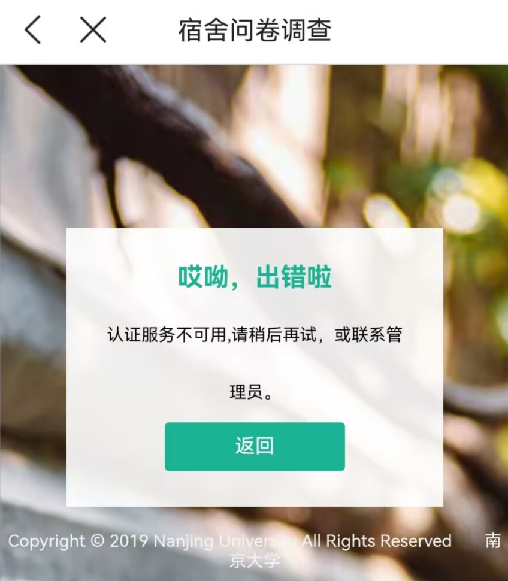

A：APP**设置中清理缓存**或**退出账号重新登录**。或选择在电脑网页端的迎新系统中填写宿舍问卷调查。

#### **Q：宿舍床位有多大呀？床帘该买多大尺寸？**
A：不同宿舍楼的床位因为家具更新时间不同而有所不同。南园一舍2m*0.91m（23年暑期新换的家具）；南园二舍1.93*0.87；南园三舍1.92*0.83；南园六舍1.95*0.85（六舍加长床2.2m*1m）；南园13舍1.93*0.84；陶园二舍、陶园三舍1.95*0.85。**上述尺寸有可能会发生变动，仅供参考。**

床帘建议到校后具体测量后购买，**鼓楼宿舍的层高比较复杂**。

**更多宿舍相关信息请认真阅读：**

[南大宿舍全知道鼓楼篇（2024.08更新版）](https://www.yuque.com/greatnju/q-a/lutlp90yd8y59xv3)

#### Q：南大APP中填写基本信息时，出现提示"param DZXX hasn't setted in update gxjbxxdz.update."(如下图)而无法提交?
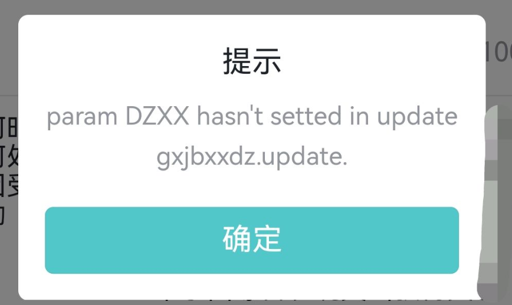

A：该提示提醒你个人信息中的**电子信箱****必须填写！！！！**可以填写**个人邮箱（如QQ邮箱、网易邮箱等）或者学校的学生邮箱（学号@smail.nju.edu.cn）。**

#### Q：行前作业是什么？一定要写吗？
A：行前作业是新生入学前学校给新生布置的任务，详情请看**下方链接或pdf**。行前作业原则上需要完成。

[关于做好南京大学2024级本科新生行前作业的通知 - 南京大学迎新网 通知公告](https://admission.nju.edu.cn//tzgg/20240801/i271342.html)

[关于做好南京大学2024级本科新生“行前作业”的通知.pdf](https://www.yuque.com/attachments/yuque/0/2025/pdf/34810676/1746452057882-87f94d26-2b05-42e1-a1b6-2948bab90afd.pdf)

#### Q：开学有考试吗？ 【24级暂无通知，请以后续最新通知为准】
A：~~**必选项**~~~~：英语分级考试，目的是区分大家英语水平，以便进行~~~~**分层教学**~~~~帮助大家顺利通过四六级考试，因此不用担心，考出真实水平即可，不需要特意准备。 ~~

~~**不确定项**~~~~：如果想选修*层次数学的人过多（数学系准入课程）也会组织数学摸底考试来决定修读资格。~~

**  2024级新生目前可以参考以下的往年情况，实际情况以今年的官方通知为准。**

:::color4
2023.8.12：部分院系辅导员通知，**23级**英语分级考试和数学摸底考试**均不举行**。

:::

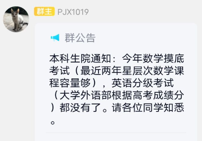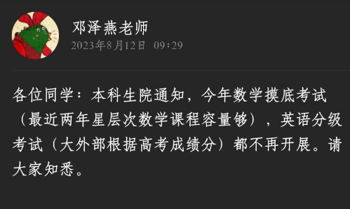

另外，英语分级仅为适配不同英语水平开展教学，英语成绩和老师及个人努力关系密切，不用过多纠结具体分级，各分级详细教学内容可参考下方语雀文档。

[关于英语分级考试（2022）](https://www.yuque.com/greatnju/q-a/wwn0f6)

**可选项**：二次选拔考试，目的是入选拔尖计划，相当于一次转专业机会，因此通常只能选择其中一个专业报考。拔尖计划学生与大班学生教学计划不同，要求更高，具有较高的保研率，且为滚动制。详细内容请自行前往**拔尖计划群628661817**咨询。P.S.强基学生不可参加， 综评学生可以参加。

> 根据2023年综评招生简章：学科兴趣类录取至专业类的考生，入学后仅可在专业类内确定主修专业、毕业准出；录取至专业的，只可在本专业毕业准出。因此学科兴趣类同学是否可以参与非本专业二次选拔还未知
>

#### Q：档案是邮寄还是自带？
A：根据2024级新生入学指南：** 档案邮寄方式请咨询新生学院相应书院辅导员；自行携带档案到校的新生，应在报到后及时转交给所在书院**。也就是说，<u>选择</u>**<u>邮寄</u>**<u>的同学请向</u>**<u>辅导员</u>**<u>咨询邮寄地址、收件人及联系方式，</u>**<u>不要自己随便填联系人！！！</u>**避免开学后找不到档案；自带的同学保管好自己的档案，开学后等辅导员通知，会统一收。**如果自己高中学校没要求的情况下，两种方式自行选择，若选择邮寄则一定要如前所述，向辅导员问清楚相关信息。**

#### Q：团关系转接
A：智慧团建+团档案转接

1. 智慧团建系统申请团组织关系转入，**江苏团省委 - ****南京大学团委**** - 新生学院团委 - XX 书院团总支****（****不要选南京市团委，选江苏省团委后直接选南京大学团委！！！然后再进行后续选择！！！要选新生学院团委不要选到具体专业的院系！！！不要只选南京大学团委，会被打回！！！****）**
    1. ** 生源地为****【北京、广东、福建】****三省市的团员:  
****应直接在****京、粤、闽的智慧团建平台****上直接发起组织关系转接**，院系团组织接收后即可在全国智慧团建系统登录**（自动生成账号，默认密码为身份证后6/8位）。  
****【不需要】****在全国智慧团建系统上重新注册，否则会导致账号冲突等问题。  **

:::color4
2023.8.15：若你为团支部的**管理员（团支书）**，需要等待你所在支部**其他同学都转出后**方可申请转出。

:::

2. 纸质团员档案，包括**入团志愿书、团员证、团组织关系介绍信**等，请妥善保管，待报到后按书院团总支通知集中收取  
    1.  **【介绍信抬头】共青团南京大学新生学院委员会XX书院团总支**，**地址：江苏省南京市鼓楼区汉口路22号。 **（通知来源：行知书院23级新生群）

#### Q：智慧团建网页版不显示验证码图片？
A：这是由于智慧团建**网页端**链接其实有两个，一个是[https://zhtj.youth.cn/zhtj/](https://zhtj.youth.cn/zhtj/)，一个是[https://www.zhtj.youth.cn/zhtj/](https://www.zhtj.youth.cn/zhtj/)，**后者存在不显示验证码图形的bug 而前者无问题**。如使用了后者网页**请去掉地址栏中的www.或直接访问链接**[**https://zhtj.youth.cn/zhtj/**](https://zhtj.youth.cn/zhtj/)**。**

[网上共青团·智慧团建](https://zhtj.youth.cn/zhtj/)

#### Q：证件照？
A： 需要准备**近期一寸彩色证件照片 2 张、两寸彩色证件照片 2 张**，均要求**白底**；开学后还会统一进行线下的新生电子照片采集，用于**学籍档案、学生证、全国大学英语四六级考试**等 ，具体采集时间、地点、要求详见报到现场公告或书院辅导员通知。

#### Q：社团？ 
A：最新介绍可以浏览迎新网的通知公告或24社团推介文档（见下方）。

[【南京大学2023-2024学年学生社团介绍】南京大学迎新网 通知公告](https://admission.nju.edu.cn//tzgg/20240812/i272983.html)

[社团推介](https://docs.qq.com/aio/DSVVYZ1hrRHprVHRK)

也可以浏览南哪助手语雀中社团介绍专栏。

[南大社团介绍](https://www.yuque.com/greatnju/group)

最后想再进一步具体了解更多更新的社团推介信息的话，请移步**2024NJU社团推介群 983092606**  

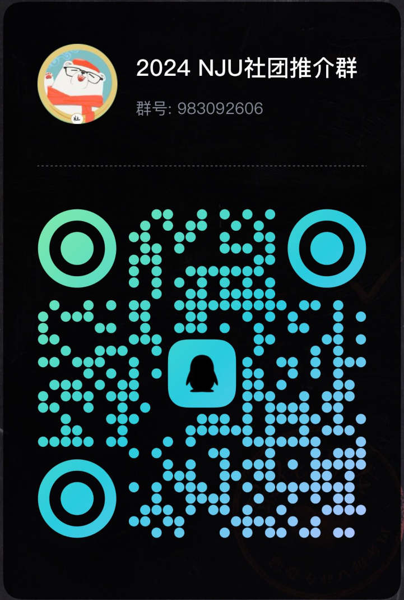

#### Q：本科新生军训时间？
A：24级本科新生军训时间在**8月26日至9月14日，历时20天****，详情见如下推送**。

[军训指南 | 小蓝鲸们，军训指南请查收！](https://mp.weixin.qq.com/s/_rQnnq2r_ub8lbmsOVMyqg)

#### Q：新生先修营是啥？什么时候出结果？ 参营学生在先修营结束到报道前的时间住哪  ？
A：提前一周左右到校报到，每天开学习方法、南大校史、学工经验等讲座，参与**迎新工作**（提供志愿时长），有名额限制，主要是有考虑将来承担**学工工作**的同学参加，即不一定每位同学都要参与，不必焦虑。

**报名工作的详细通知内容如下**：

[关于开展2024年南京大学新生先修营报名工作的通知](https://mp.weixin.qq.com/s?__biz=MzkwNDE4ODYyMg==&mid=2247493883&idx=1&sn=c0d5b6dca58e6bf70205ab6675f3a5a2&chksm=c1aa363a83366596b7317f67912d32b9b14826b32d55188317bc1142781be92139d85a317530&mpshare=1&scene=23&srcid=0806IQYsBXrng4rnpLH9lbDh&sharer_shareinfo=ffa280098668663e27fae51717fd1747&sharer_shareinfo_first=b54b19c83c728fdc6084b1ac6ba325db#rd)

按往年经验，先修营的同学会先集中住宿，也就是说你所住的先修营的宿舍，一般来说与正式开学报道后的宿舍不同。

:::color4
~~2023.8.15：部分院系辅导员通知， 先修营~~~~**18号傍晚报名截止**~~~~，预计~~~~**20-21号出名单**~~~~。 ~~ 先修营结束后到报道前的时间，**参营同学住在学校里**。

:::

ps. 志愿时长：各院系重视程度和评奖评优要求不同，具体请咨询同专业学长姐，一般相对容易达到，**不必焦虑**。

#### 
#### Q：考四六级？
A：南京大学规定需要学完大学英语课程才能报考，因而大一上不能报名考四级，最快路径是**大一下考过四级，大二上考过六级**。[**本科生院官网**](https://jw.nju.edu.cn/)会发布报名通知，辅导员等老师可能也会转发，自己如要报名**请自行关注通知**。

#### Q：电话卡？校园卡？
A：电话卡所谓的“校园套餐”**≠** 我们常说的校园卡。警惕办卡骗局，任何**以“校园卡”“校园网”来推销让你办卡、办套餐**的，一律当**骗子**处理。我们常说的**校园卡**，是新生报道时免费发放的、作为在校学生身份标志的一张实体卡，可以用于校园消费、通行门禁等。而**校园网作为无线网络**，在教室、宿舍、食堂全覆盖，且不需要登记身份证号等任何个人信息，具体见下面的介绍。换言之，**不办理运营商所谓的“校园卡”“校园网”套餐，也可以在学校内正常生活**；需要警惕某些人以“不办卡就没法在学校内上网”、“不办就没法报道”等理由来进行推销。当然，也不是将办卡一律视作洪水猛兽，自己多留心眼按需办理划算套餐也是可以的，已有套餐流量充足的话完全无需办新卡新套餐。

[新生入学防诈骗指南](https://www.yuque.com/greatnju/q-a/daxpyo)

#### Q：选课相关？课表？
A：**2024级大一新生选课通知未出**，别急，有兴趣同学可以提前了解南京大学的课程体系。

**（当然一切指南都仅供参考，因为万事万物都不可能一成不变，越新的文章参考价值越大）**

**（如果以下文章有内容冲突或过时，欢迎向我们联系反馈进行修改）**

[24新生指南20丨2024级本科新生选课指南！选课前必读！](https://mp.weixin.qq.com/s/2xRD80tmADoqItPi6PFimg)

[来稿丨南京大学本科生课程体系导论（2024.07更新）](https://www.yuque.com/greatnju/q-a/mnlg8gqh06fqwzrb)

[【通修】课程体系介绍（适用于21级及之后）](https://www.yuque.com/greatnju/q-a/rnvqim)

[【通识】课程体系介绍（适用于21级及之后）](https://www.yuque.com/greatnju/q-a/nyrrkz)

[来稿 | 【梦起南雍】课程与分数篇](https://www.yuque.com/greatnju/q-a/contribution-course)

然后请阅读选课指导（2022级版）**【由于是2022级版，24级新生请酌情参考】**

[选课指导(2022级版)v1.3.3](https://www.yuque.com/greatnju/q-a/fvc5vt)

**最后选课时间应该不会太早，暑假期间不要着急。**

**各院系课表可以参考南哪咨询群的群文件-2024-2025学年第一学期全校课表。**

#### Q：宿舍用品
A：入学指南中教育超市一般会提供480套餐，包含基本的生活物品套装，通知发布后可以自行扫码购买。

也可以自行购买后在开学期间邮寄/自带到校，具体需要携带什么物品可查看下方链接或自行在网络中进行搜索

[新生开学物品清单](https://www.yuque.com/greatnju/q-a/kw4c0u)

[新生需要提前购置什么？](https://www.yuque.com/greatnju/q-a/thp8ur)

#### Q：邮寄行李地址怎么填啊？快递点在哪？
A：**江苏省南京市鼓楼区湖南路街道汉口路22号（南京大学鼓楼校区）**。校内南园有一个菜鸟驿站（在南园喷泉旁边），圆通申通快递点在校外一小段距离，新生报道时还会在南园篮球场设置临时快递点，因此**不建议选择申通圆通**邮寄大件物品，也**不要提前太早**邮寄东西到学校，越早寄到报道时通常可能越难找（不过一般不会退回），除此之外特大件快递更可能是放在室外的（可能有棚子），寄早了遇到暴雨的可能性更大，容易沾湿，算好时间提前两天内寄到最宜。

#### Q：驾照等证件加学分/加分吗？
A：在南京大学，驾驶证/结婚证**不加学分，也不加绩点**。

#### Q：校历上写着的「暑期学校」是什么呀？暑假到底放多久？
A： 暑期学校是指在暑期开设的额外的小学期，暑校期间有各种课程开设，包含实践教学、暑期课程、暑期学术讲座、学科竞赛、大学生创新创业训练计划等多类型，其中有特定年级部分专业在有暑期学校的必修课（**请以最新的培养方案或院系教务通知为准**）；**大部分专业没有强制要求**，可以凭兴趣与专业意向来自行判断选或不选。没有必修要求的，不选也没影响。

如果你没有暑期学校的课程，春季学期的期末考都考完了，且没有其他必要事项，则你的暑假就开始了。大部分人是在6月底或7月初考完试，考完即放假

#### Q：南大有晚自习吗？有跑操吗？
A：都没有！

## 本科新生宿舍
[南大宿舍全知道鼓楼篇（2024.08.25更新版）](https://www.yuque.com/greatnju/q-a/lutlp90yd8y59xv3)

## 校园生活

#### Q：为什么充值校园卡出现了不符合监管反……的情况？
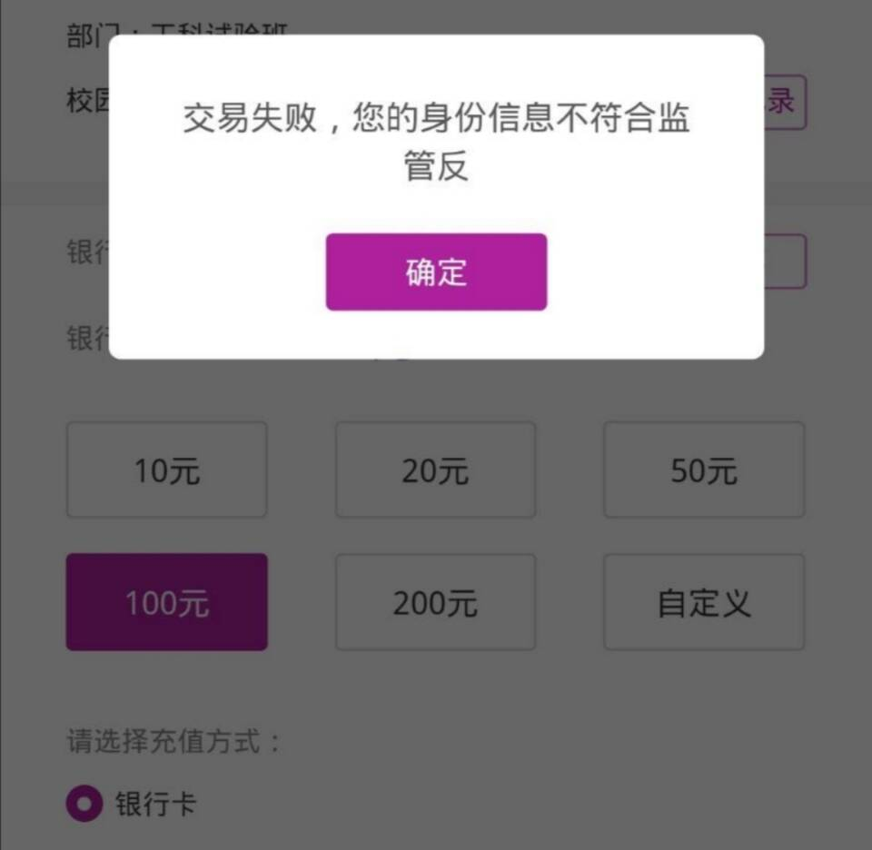

A：可能是因为身份证过期后，没有到工商银行更新个人信息，需要在手机工商银行上面补充一下个人信息或者到学校对面的工商银行进行操作。

#### Q：教室里和图书馆里的空调怎么控制啊？
A：教室里的是中央空调，你只能选择开或者关。图书馆的空调可以在墙上控制，建议不要调太高或者太低 。

#### Q：宿舍里有马蜂窝怎么办？
A：尽快联系保卫处进行处理。保卫处24小时值班报警电话89685110（仙林）、83595110（鼓楼）

#### Q：寒假/暑假可以留在学校吗？
A：可以，可以一直留着。其中寒假期间仙林校区会安排集中住宿，一般在腊月廿七到正月初八。如果所在宿舍楼人数很少，可能会提前安排集中住宿。具体寒暑假留校信息可以参考南大育教公众号（党委学生工作部＋本科生院官方平台，原南大学工公众号）推送。暑假则没有集中住宿，无特殊情况下基本可以住在自己原宿舍内。

## 鼓楼生活
[学校周边交通&设施&娱乐](https://www.yuque.com/greatnju/q-a/azw0f2)

## 仙林生活
#### Q：学校里和学校附近哪里可以理发呀？
A：学校里四栋楼下有一家“阿玛尼”，可以理发；男生理发15元一次。学校对面和园有几家理发店，但是比较贵，还诱导你办卡消费，还动不动就倒闭找不到……有人说学校里理发不好看，其实我觉得都差不多，好看不好看主要看脸……

#### Q：学校里有健身房吗？器械怎么样呀？有没有打篮球、踢足球、打羽毛球、打乒乓球、打网球的地方呢？学校里有游泳馆吗？
A：学校里有两个健身房，一个在四组团体育馆，一个在一组团方肇周体育馆。内部设施基本齐全，并且对本校师生免费。学校里有多个区域设有室外篮球场，方肇周和四组团体育馆内部也有篮球场，不过室内场馆一般不开放。学校有炜华体育场、四组团足球场和四组团小足球场三个场地可以踢球，其中四组团足球场是真草足球场，一般不对校队之外的同学开放。方肇周体育馆内有羽毛球和乒乓球场地，每天上午8点在南大app中进行预约场地。五栋北边有网球场。

学校内有游泳馆，十块钱一次，可以洗澡。但疫情期间停止开放，目前已恢复正常

#### Q：学校里哪里可以给电动车充电呀
A：21栋留学生公寓一楼停车平台，五栋院子里，游泳馆旁边，十食堂附近，四食堂的北侧（从靠里边的地方的斜坡下去），行政北楼-1楼（比较偏，在出口的大坡正下方）

#### Q：学校哪里可以修自行车/电动车呀？
A：一栋和三栋之间的一楼里边，大气楼门口。

#### Q：学校哪里可以给自行车打气呀？
A：前一个问题两个修车的地方，宿舍楼找阿姨借，以及仙二靠近操场那一侧（即仙二西侧）有自助打气点。

#### Q：校医院可以打狂犬疫苗吗？
A：不可以，最近的接种点可以去仙林社区卫生服务中心。

:::color5
✌️小助手给每个认真看到结尾的人点赞！！！

:::

---

#### 写在最后：
扫描下方中间二维码即可加入24级本科新生咨询群，扫描下方右侧二维码即可加入24级研究生交流群，有问题可以在群里提问哦。  

[南哪助手长期接受同学们投稿](https://www.yuque.com/greatnju/q-a/gw3phd#k6p5Y)

