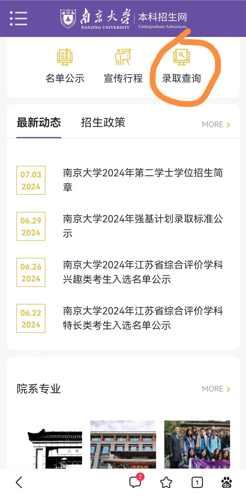
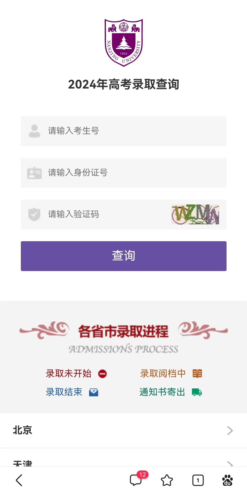
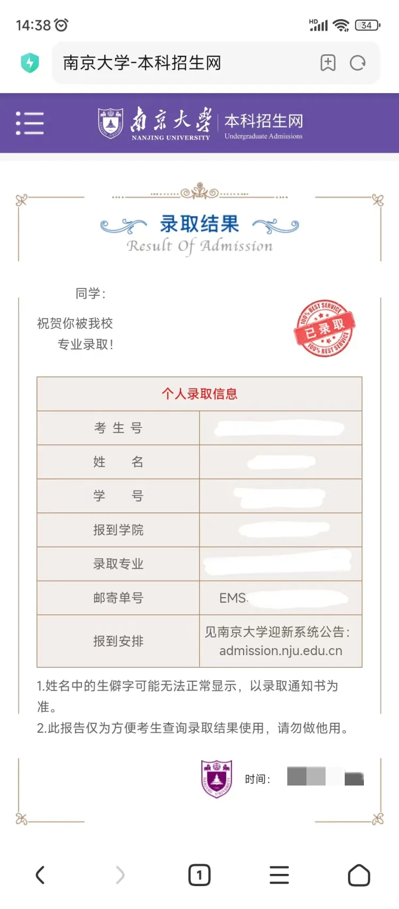

南京大学2024新生学号有两种查询方式

1.进入南京大学本科招生网录取查询模块（[https://bkzs.nju.edu.cn/static/mobile/front/nju/basic/html_web/lqcx.html](https://bkzs.nju.edu.cn/static/mobile/front/nju/basic/html_web/lqcx.html)）-输入考生号和身份证

2.登陆迎新系统（[admission.nju.edu.cn](https://admission.nju.edu.cn)）-输入考生号和身份证号

温馨提示：此处输入的考生号应为14位考生号

**<u>陕西考生是2461+准考证号10位</u>**

**<u>湖南考生是2443+考生号10位（不是包含字母的准考证号）</u>**

**<u>广东考生是2444+考生号10位</u>**

**<u>云南考生去云南高考的报名和志愿填报平台 gk.ynzs.cn 查考生号，2453开头的14位数字</u>**

如果有新生发现自己的准考证号非14位，也不是以上省份，可以在本推送评论区留言或者在南哪24级本科新生咨询群提问。

