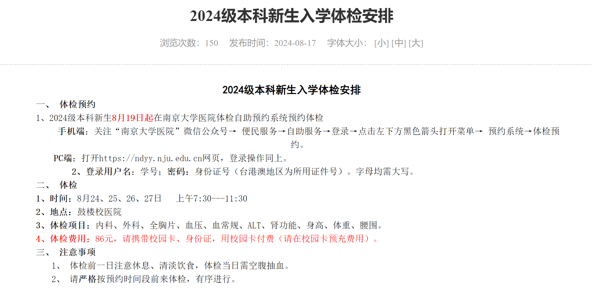

# **一、体检预约**
1、2024级本科新生**8月19日**起在南京大学医院体检自助预约系统预约体检。（**注：**所以在这之前登录不上校医院**是正常的！**到时间就可以登录了！）

## **手机端：**
（1）关注**“南京大学医院”**微信公众号：

（2）便民服务→自助服务→登录→点击左下方黑色箭头打开菜单→预约系统→体检预约。  

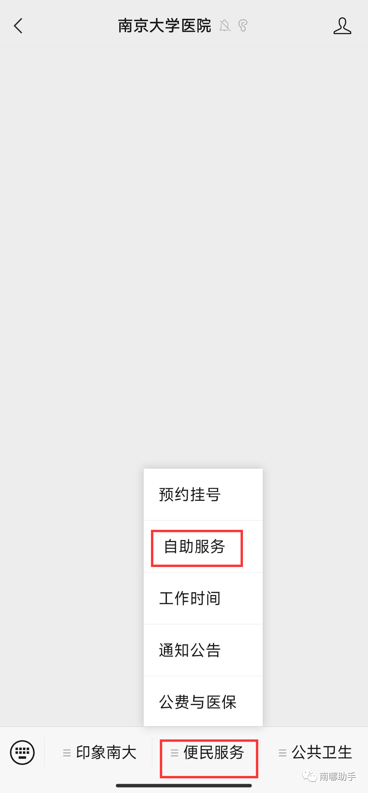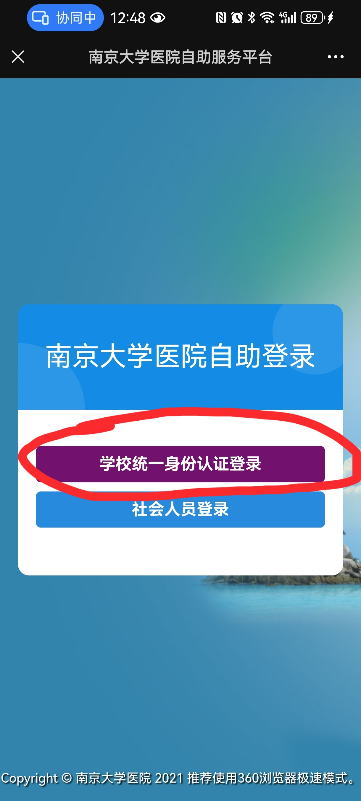

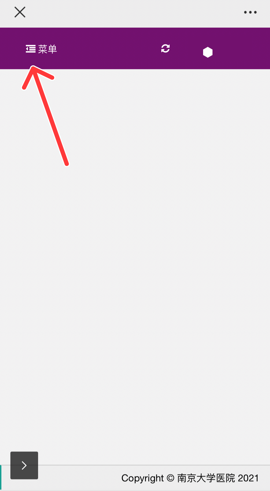

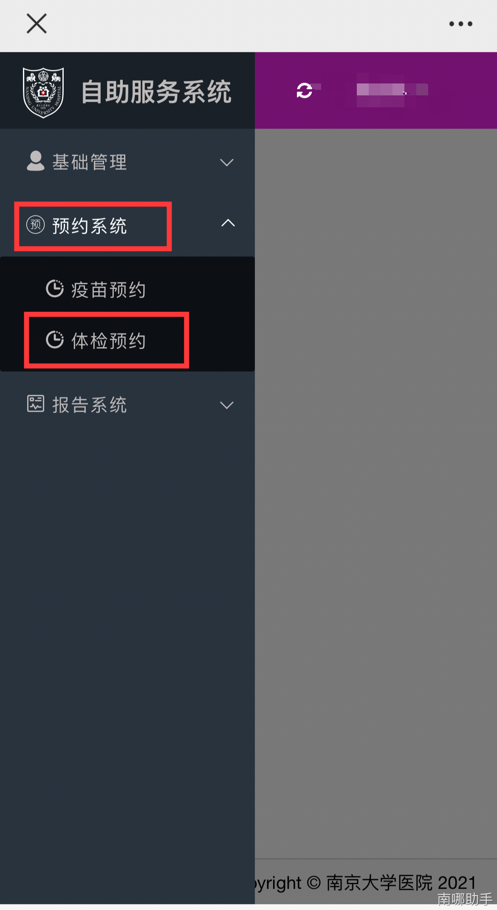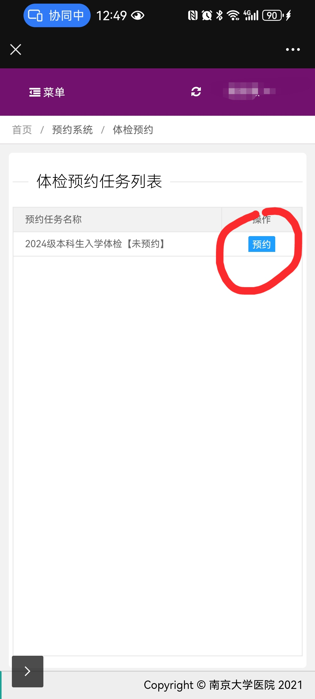

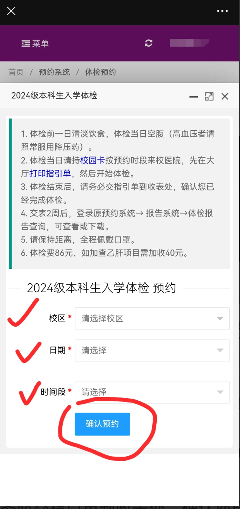

以下时间段可选择：

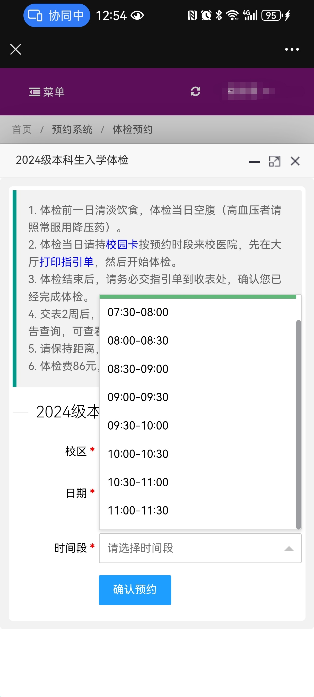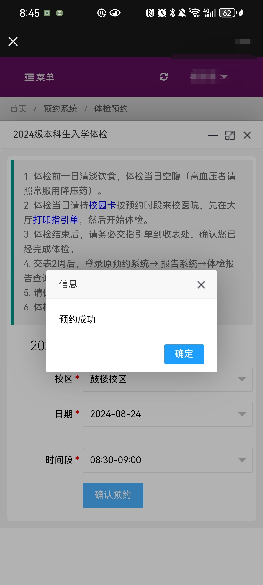

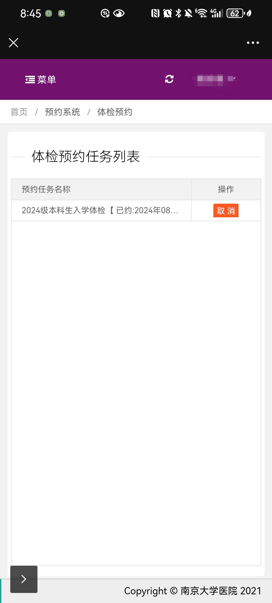

  

## **PC端:**
打开**http://ndyy.nju.edu.cn**网页，登录操作同上。

[南京大学医院自助登录](http://ndyy.nju.edu.cn/)

2.登录用户名：**学号**；密码：**身份证号**（台港澳地区为所用证件号）。字母均需大写。

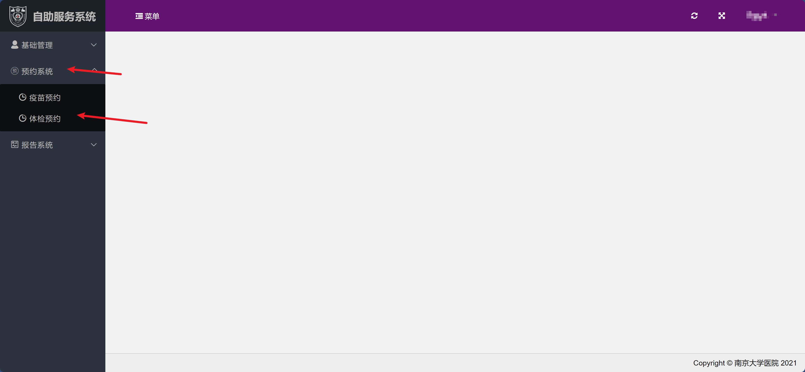

3.其余操作同手机端

4.预约成功画面：

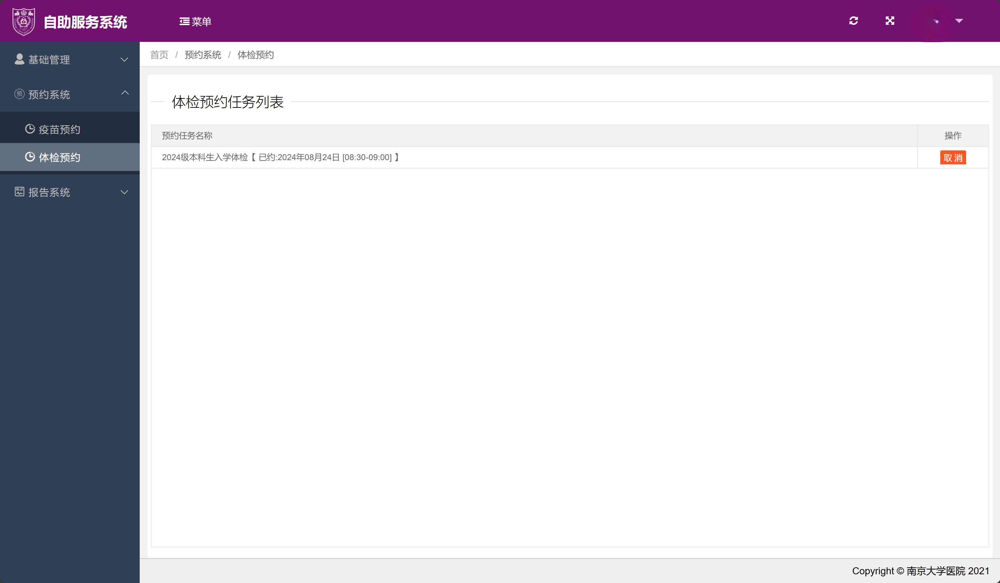  

# **二、体检**
## **1.时间：**
8月24、25、26、27日  

上午7:30---11:30

## **2.地点：**
鼓楼校医院

[amap](https://ditu.amap.com/place/B001906FML)

## **3.体检项目：**
内科、外科、全胸片、血压、血常规、ALT、肾功能、身高、体重、腰围。

## **4.体检费用：**
:::danger
86元，请<u>携带校园卡</u>、<u>身份证</u>，**用校园卡付费**（请在校园卡预充费用)（如果你不知道什么是校园卡，可以阅读助手往期推送：

:::

[24新生指南13丨如何获取、使用南京大学校园卡（本研通用）](https://mp.weixin.qq.com/s/7qxEnO6eyUveb42P8VWaTQ)

  

# **三、注意事项**
:::info
1、体检前一日注意休息、清淡饮食，体检当日需空腹抽血

:::

:::info
2、请严格按预约时间段前来体检，有序进行。

:::

源文件指路：

[https://admission.nju.edu.cn//tzgg/20240817/i273114.html](https://admission.nju.edu.cn//tzgg/20240817/i273114.html)

# **四、注明**
**注：****研究生**新生入学体检安排请耐心**等待学校后续通知！**

  

