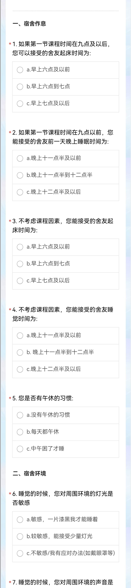
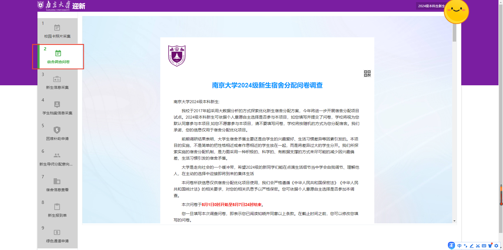

       往年，南大曾以院系内随机或院系内依据姓名拼音生日录取号等不同排序方式分配过新生宿舍，虽有一定的管理便利，但生活习惯等方面的差异。也引发了一定程度的宿舍内部矛盾。

        2017和2018年，南京大学曾进行过两次“本科新生生活习惯普查”问卷调查，调查了17级和18级小蓝鲸的生活习惯和对舍友的期许，并基于调研结果进行了宿舍分配，效果良好，还被多家媒体争相报道。但后期因出现新老生混住情况，宿舍调查问卷不便进行，所以19年开始又恢复了院系内的随机分配方法。

        2022年，因“寻根计划”的开展，所有本科新生将到鼓楼校区进行为期一年的学习生活，新生不用和老生混住了，这也为宿舍分配的展开提供了必要条件。

      	2024年，南京大学将进一步试点实施新生宿舍分配优化方案。2024级本科新生可依据个人意愿自主选择是否参与本项目，如您填写并提交了问卷，学校将视为您默认同意参与本项目；如您不愿意参与本项目，请不要填写问卷，学校将按随机的方式为您分配宿舍。我们承诺，您的信息仅用于宿舍分配优化项目。

        本次宿舍分配活动从2024年8月1日开始，将于2024年8月7日24时结束，所以想要参与问卷填写的同学们请抓紧时间哦！

       南京大学2024级宿舍问卷调查都是通过迎新系统（[admission.nju.edu.cn](https://admission.nju.edu.cn)）进行的，该系统有两种进入方式。

1.  南京大学APP-本科生迎新服务-宿舍问卷调查 

2.  登陆南京大学迎新网（[admission.nju.edu.cn](https://admission.nju.edu.cn)）-本科生迎新服务-宿舍问卷调查 

        其中登陆账号为学号，初始密码为身份证全部（如过更改过，密码则就是更改后的）。

        最后，小破手还想啰嗦啰嗦，虽然我们普遍认为，大学生宿舍矛盾主要是由兴趣爱好、生活习惯差异等因素引发的，但是，我们也不能简单地认为学校通过这个问卷把性格相近或者作息相近的同学们分在了一起，更严谨的说法应该是把差异很大的新生分开了。

        南京大学启用宿舍分配机制，其本质上是尽可能地减少那些因兴趣偏差、生活习惯引发的矛盾，但我们也不能单纯希望通过填写问卷分配宿舍就能彻底避免它们，宿舍的温馨环境更需要每一个同学的持续努力和维持。

        我们更应该学会自我调节，处理人际关系，而这也是大家将要在大学学习的第一课。

        小助手祝大家都能够在南京大学学习生活顺利哦！

