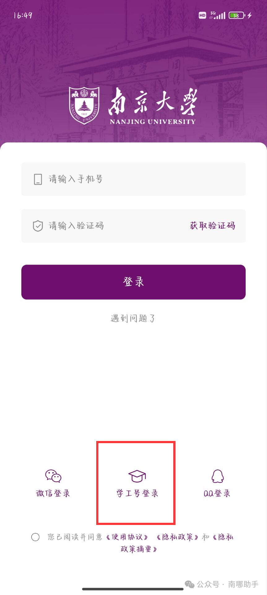
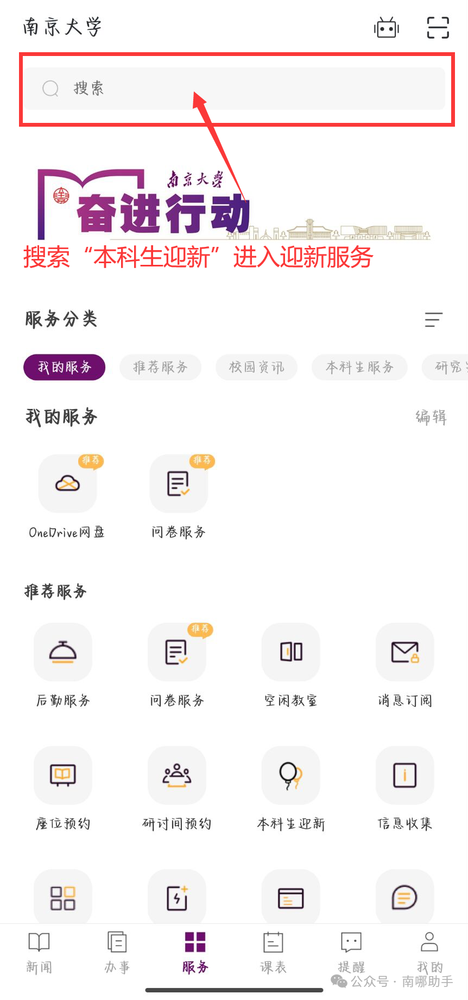
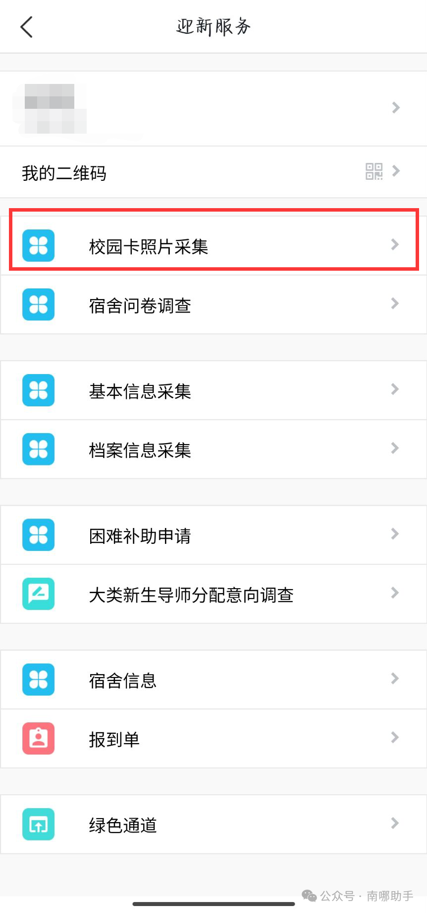
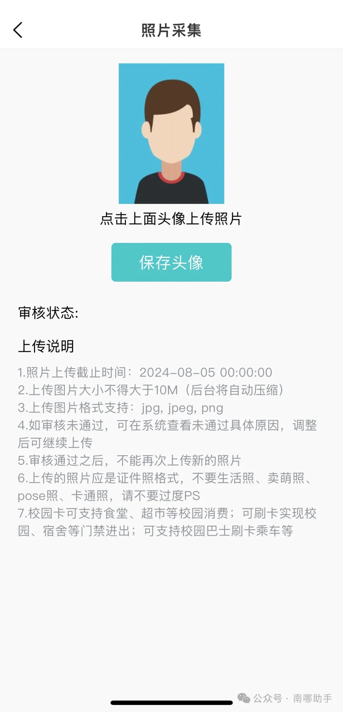
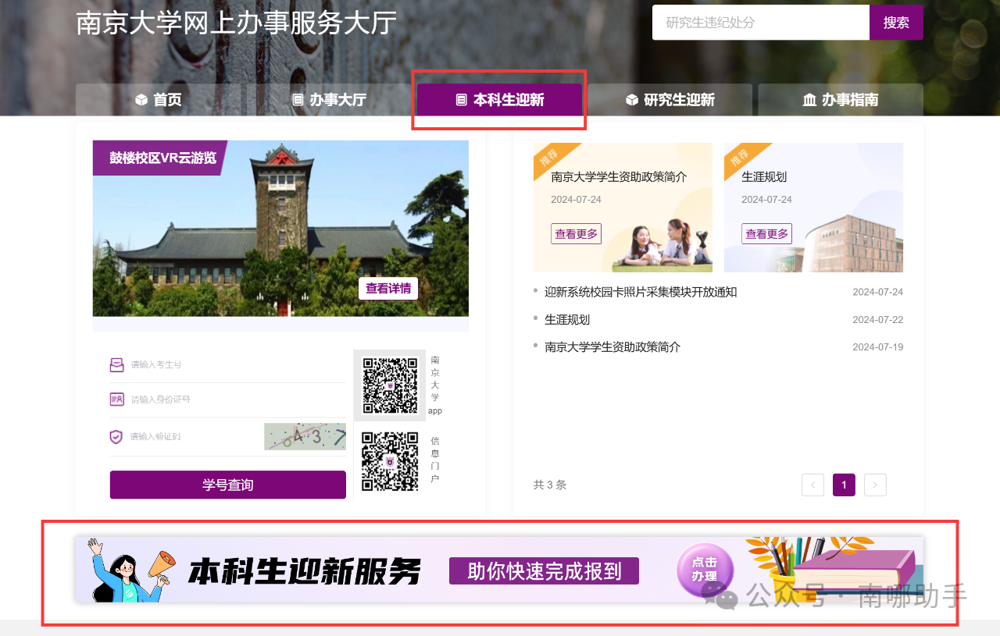
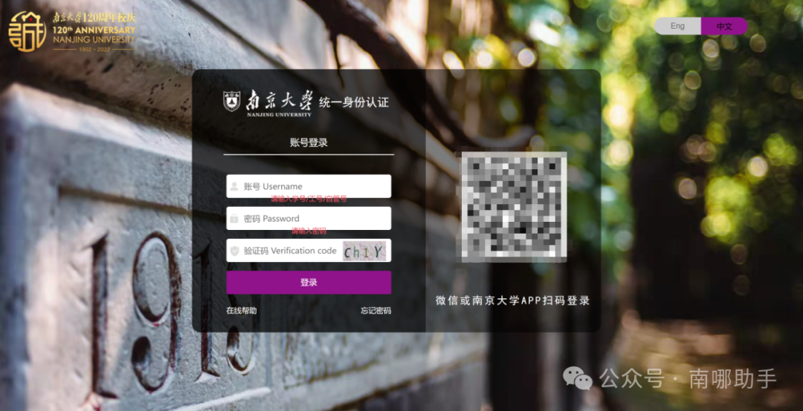
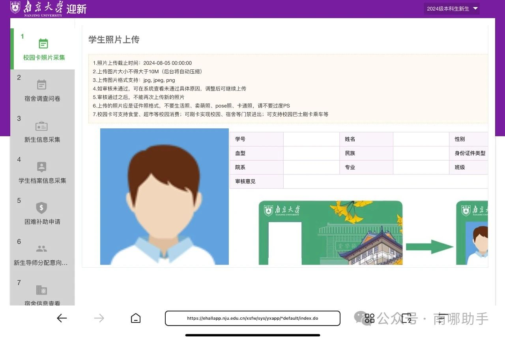

随着今年入学季的到来，2024级本科生更换校园卡照片的服务已经开启，**8月5日0:00**（系统预计关闭时间）之前，本科新生都可通过迎新系统更换校园卡照片！错过这次机会，你可能会后悔四年哦！南京大学2024级新生校园卡照片采集都是通过迎新系统（[admission.nju.edu.cn](https://admission.nju.edu.cn)）进行的，该系统有两种进入方式。

1.南京大学APP-本科生迎新服务-校园卡照片采集

（1）下载南京大学app。苹果手机用户可以在苹果的App Store搜索下载“**南京大学**”APP并安装；安卓手机用户请复制链接（https://static.campushoy.com/ldy/nju/index.html）或加入**【南哪2024级本科新生咨询②群】（群号985550818）**，在群文件中下载安装包。

（2）登录南大app。首次登录请选择下方学工号登录，账号为学号，初始密码为**个人身份证号码**（港澳台侨学生为通行证号）。

**注意：**

[1] 如果之前登录过南京大学统一身份认证修改过密码，那么在登录时请**使用修改过的密码**——因为APP的学工号登录本质上也是统一身份认证，这是相通的。

[2] 因录取进度不同，部分同学的信息还未录入，所以确定账号密码输入无误但登录不了不要急，等一段时间就可以了。

[3] 因同时太多人登录容易造成服务器崩溃，所以如果点进去白屏不要着急，稍等后会恢复。

  

（3）搜索**“本科生迎新”**，进入迎新服务；

（4）点击**“校园卡照片采集”**；

（5）上传图片即可。

2.登陆南京大学迎新网-本科生迎新服务-校园卡照片采集

（1）请使用**电脑端**访问本科生迎新服务(https://ehall.nju.edu.cn/2024)

（2）点击下方本科生迎新服务：

（3）经统一身份认证登录系统，账号为**学号**，初始密码为**个人身份证号码**（港澳台侨学生为通行证号），第一次登录需要更改密码。

4.登录成功后在**“校园卡照片采集”**板块根据要求上传即可。

**注意：**

[1] 如果之前登录过南大app修改过密码，那么在登录时请**使用修改过的密码**——因为APP的学工号登录本质上也是统一身份认证，这是相通的。

[2] 因录取进度不同，部分同学的信息还未录入，所以确定账号密码输入无误但登录不了不要急，等一段时间就可以了。

[3] 因同时太多人登录容易造成服务器崩溃，所以如果点进去白屏不要着急，稍等后会恢复。

**校园卡注意事项：**

1.因批量制卡需要时间，本模块拟于**8月5日0:00**关闭服务 

2.上传图片大小**不得大于10M**（后台将自动压缩） 

3.上传图片格式支持：**jpg, jpeg, png**

4.如审核未通过，可在系统查看未通过具体原因，调整后可继续上传 

5.审核通过之后，**不能再次上传**新的照片 

6.上传的照片应是证件照格式，**不要生活照、卖萌照、pose照、卡通照，请不要过度PS **

7.校园卡可支持食堂、超市等校园消费；可刷卡实现校园、宿舍等门禁进出；可支持校园巴士刷卡乘车等

  

小助手还要补充几点：

8.直接上传照片原始电子版，**不要对打印出来的照片进行翻拍，例如身份证、准考证上的照片**

7. 不要搔首弄姿或者搞其他行为艺术，照片是会人工审核的！

8. 照片**背景**不要花里胡哨的，要**纯色**！校园卡背景为绿色，请各位新生挑选相衬的颜色作为底色。

9. **记得穿衣服！**（不要问为什么会有这一个注意事项....）

正确示例（为保护学姐隐私进行了打码处理）：

