[南哪助手长期接受同学们投稿](https://www.yuque.com/greatnju/q-a/gw3phd#o8osi)

---

**写在前面：本指南关于各个宿舍情况的更新时间并不统一，有些宿舍的信息可能已经过时，请注意甄别。**

### 如何知道自己在哪个宿舍
本科新生大一统一在鼓楼

鼓楼x舍=南园x舍，陶园x舍就是陶园x舍；宿舍号是四位数，前两位代表楼层，后两位是该楼层的房间号，例如鼓楼3舍-0520说明你在南园三舍的5楼。

床位可以宿舍内你们舍友之间自行协商，基本是先到先得，学校不指定，宿舍号末尾的序号（例如鼓楼3舍-0520-3中的“-3”）只是个序号，没有实际意义，不代表学校给你分配的床位。

### 床的尺寸
南园一舍2m*0.91m（23年暑期新换的家具）；南园二舍1.93*0.87；南园三舍1.92*0.83；南园六舍1.95*0.85（六舍加长床2.2m*1m）；南园13舍1.93*0.84；陶园二舍、陶园三舍1.95*0.85。**上述尺寸有可能会发生变动，仅供参考。**

床帘建议到校后具体测量后购买，**鼓楼宿舍的层高比较复杂**。

### 部分鼓楼宿舍条件介绍：
**鼓楼很多宿舍楼还在紧张装修施工中，所以下列描述只能代表之前学长学姐住的时候的情况，实际入住后的条件请以入住时为准！！！**

#### 陶园1舍：
一共12层，男女分层混住，有门禁，配备两台电梯。四人间上床下桌，每人有单独的大衣柜，有独立卫生间，部分宿舍装有热水器，每个宿舍均有室内阳台和包含洗手池的前厅， 每层配有洗衣房（一台洗衣机），一层提供微波炉，地下一层有热水间和烘干机，整栋楼南北朝向，室内走廊，所有宿舍均朝南。

#### 陶园2舍（本科新生女生宿舍）：
装修前曾是男生宿舍，装修后为2022级、2023级女生宿舍，共十二层，有电梯，四人间，上床下桌，两宿舍阳台相连，有独立卫浴，有热水器，每层有个公用小阳台，能站两个人，洗手池只有一个，洗衣机和开水机在二楼。

装修完毕后内部大致如图：

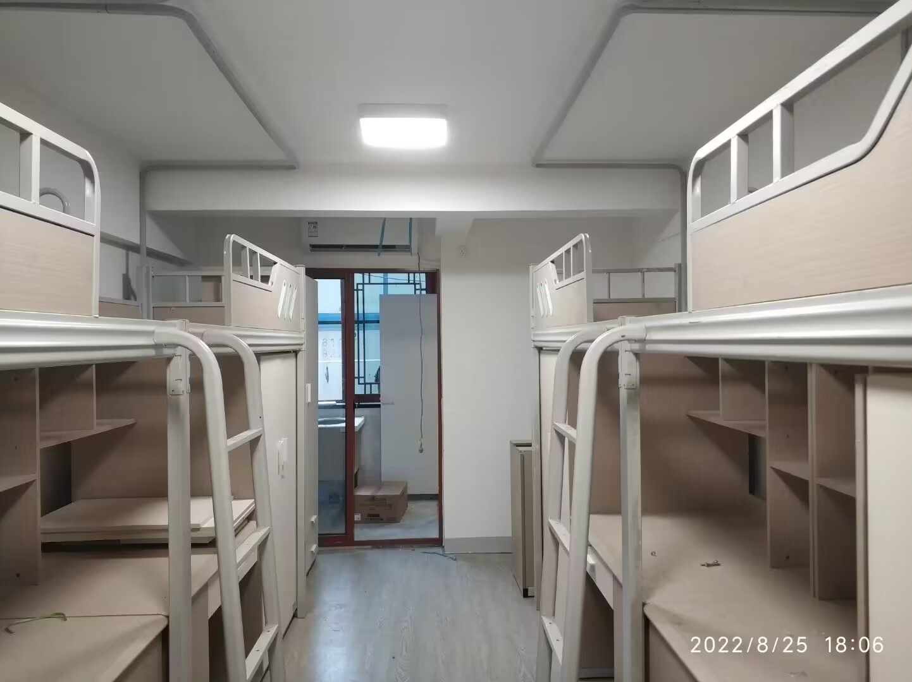

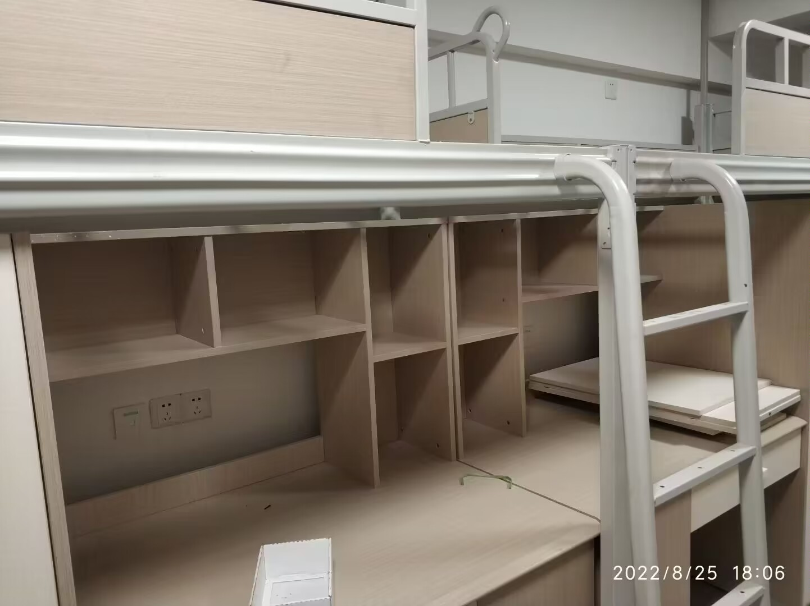

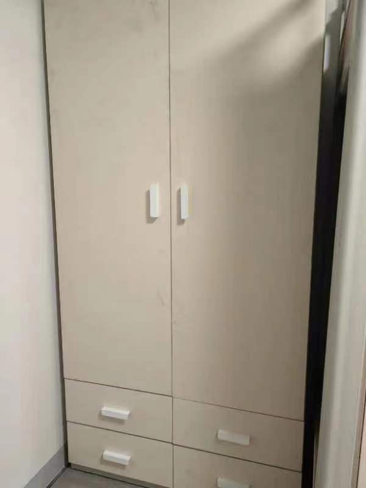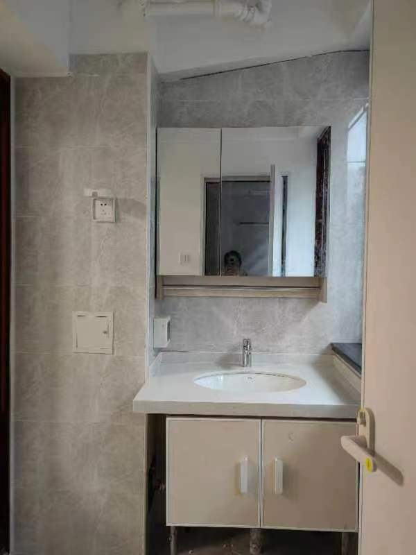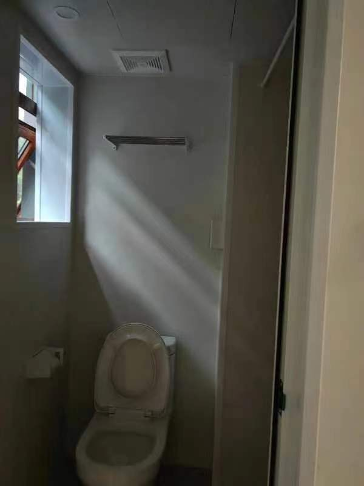

#### 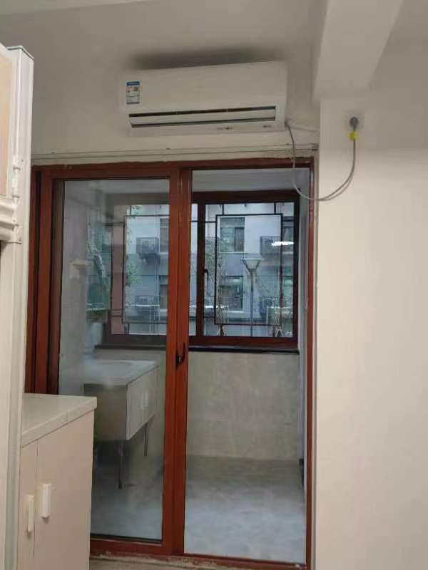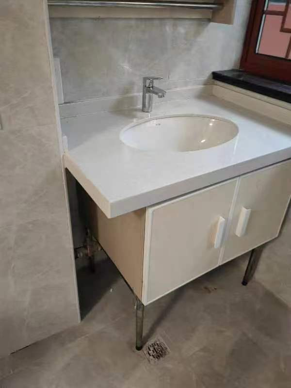
#### 陶园3舍（本科新生男生宿舍）：
男生宿舍，共十一层，有电梯，四人间，上床下桌，有室内阳台很小，四个人晒衣服不太够用，每间宿舍自带坐便器一个和淋浴器一个，有热水器，每层楼有洗衣机和开水机，一楼有烘干机，顶层可上去晒东西（下雨需要及时收回），自习室在一楼，总体情况和陶二基本一致。

#### 南园1舍（本科新生男生宿舍）：
南园一舍是一座独栋建筑，男生宿舍。有门禁，六层无电梯。四人间上床下桌，每人一个衣柜，有一个阳台，原本是独立卫浴无热水。一楼有开水房，三个热水器四台洗衣机一台烘干机。南北朝向分别开间。墙上的有线网口上限100M，四个床位中只有两个会有网线插口。2022年历经半年翻修，目前情况为：内部家具已于2023年7月拆除更换。原有的独立卫生间**加装热水器**，并加装了一系列护栏、阳台窗户，内部也进行了部分粉饰。宿舍外表已经翻新完成。****

特别提示，一舍宿舍四个床位里大约有两个床位（基本是有网线插口的床位）插座位置奇葩，几乎贴边藏在家具后，插线板几乎必备不然取不了电。

**家具更换后**的的内部状况：（以下五张照片拍摄于**2024-08-24**）

（本图为热心同学“Greenland”来稿）

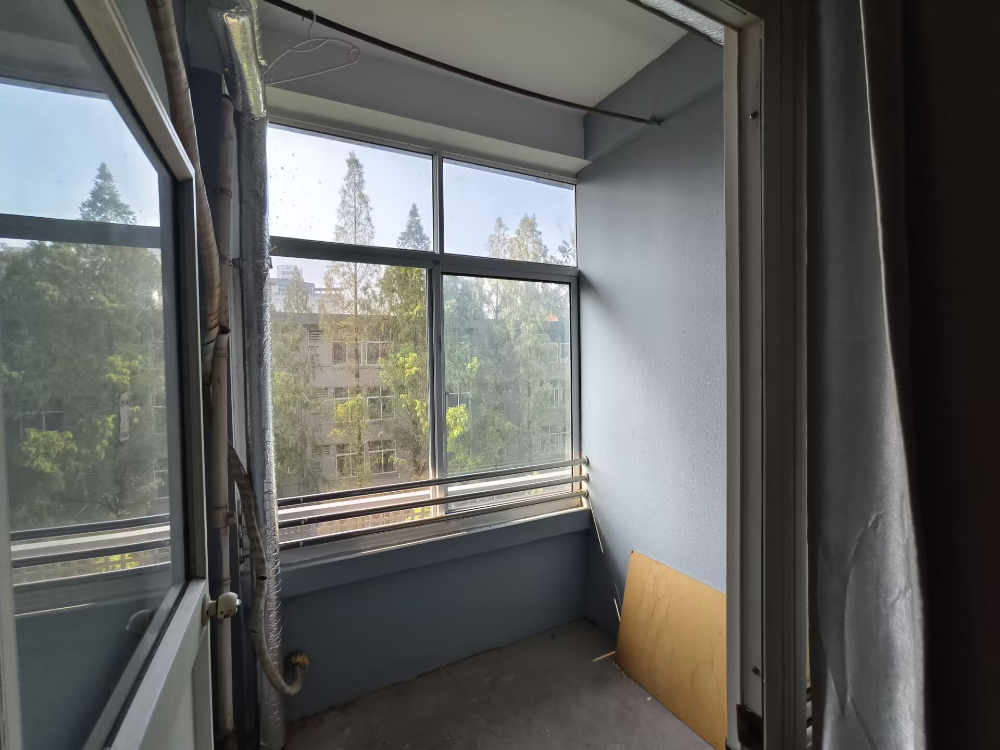

（本图为热心同学“Greenland”来稿）

（本图为热心同学“Greenland”来稿）

（本图为热心同学“Greenland”来稿）

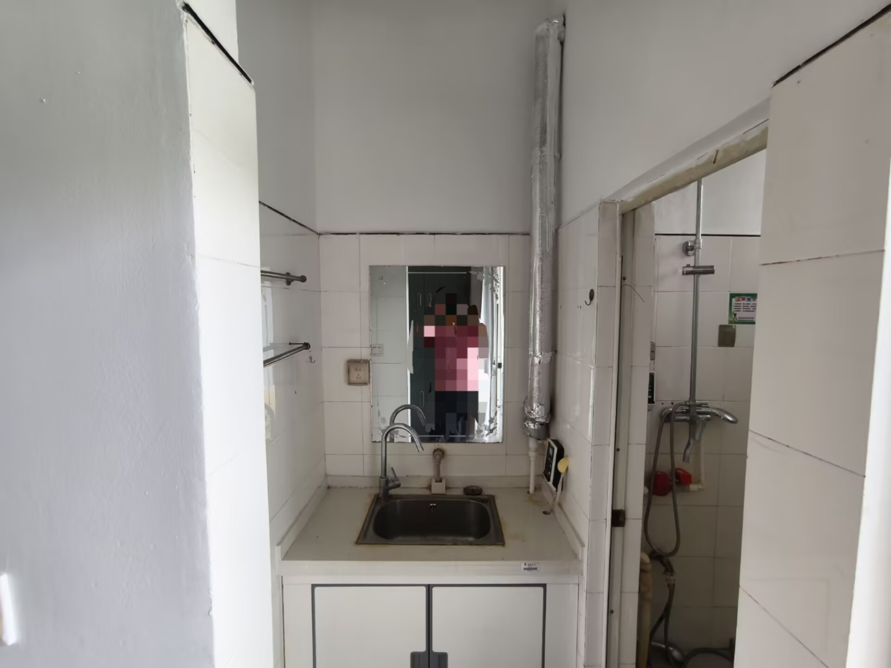

（本图为热心同学“Greenland”来稿）

翻新后的外立面：

#### 南园2、3舍（本科新生男生宿舍）：
与南园一舍室内布局基本相同，但家具稍新于一舍。一共六层，没有电梯。四人间上床下桌，四个大储物柜，有阳台、空调，有独立卫浴（可洗热水澡）、洗漱台，浴室和洗漱台插卡出热水。一楼有洗衣机，开水房，微波炉。

其中，二舍内部陈设大致如下：

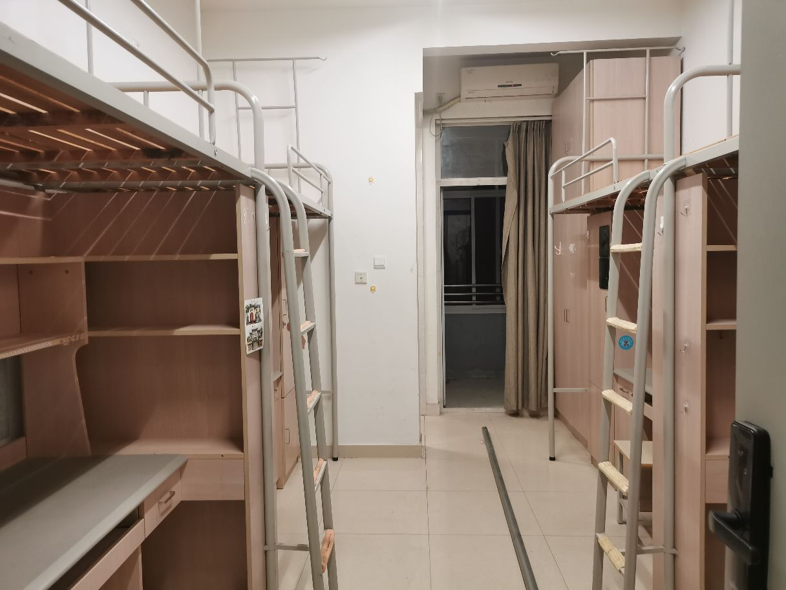

3舍内部构造大致如下：

（本图为热心同学“无念断绝”来稿）

（本图为热心同学“无念断绝”来稿）

（本图为热心同学“无念断绝”来稿）

（本图为热心同学“无念断绝”来稿）

（本图为热心同学“无念断绝”来稿）

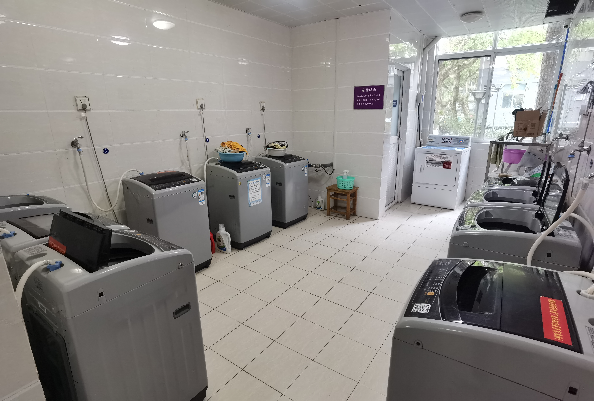

3舍入住图如下（图源22级热心群众）：

（本图为热心同学“无念断绝”来稿）

#### 南园4舍：
条件基本与南园5舍相同，是男生宿舍，已有翻新计划。

#### 南园5舍：
女生宿舍。一共六层，没有电梯，四人间上床下桌，没有阳台，室内在靠门位置有一根在半空的晾衣绳，窗户外面新安装了伸缩晾衣架，每个楼层有两个公共厕所，每个厕所有四个长水池，四个蹲坑位，一个沐浴间，每个沐浴间都配备了有热水器，可以24h淋浴。一楼有四个速热开水，5个洗衣机，一个烘干机，没有直饮水机。宿舍有限电，除了宿舍以外的地方没有插头。

#### 南园6舍：
目前装修中，以前是四人间，上床下桌，无阳台，有公共洗漱间及卫生间，1-3层公共卫生间装有热水器，可以24小时洗浴。预计改为二人间博士宿舍。

更新：2022年已经装修完毕，确定主要为二人间博士宿舍。一楼（特殊情况（受伤、身高偏高等）宿舍，据说为三个月申请一次）和楼上家具有区别。无阳台，安装有伸缩晾衣架。此外，六舍虽为双人间，但实质上是3个网口：其中一个床位是单网口，另一个是并列一个网口和一个电话线接口，**全部为千兆网**。

走廊：

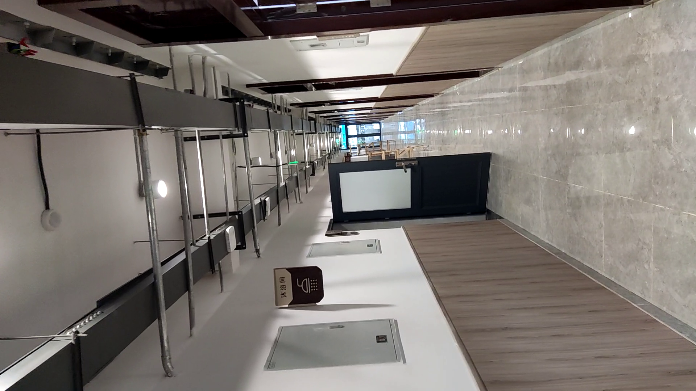

阳台伸缩晾衣架：

热水洗澡间：

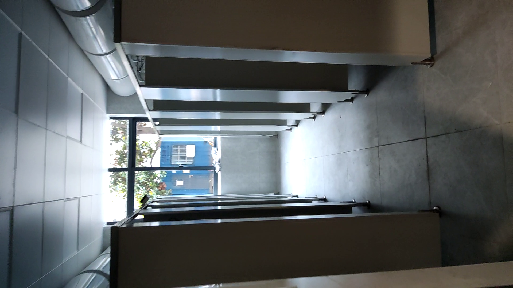

一楼是给特殊情况居住的（似乎包括加长家具），家具：

楼上的家具不一样，是博士生住的：

其中一个床位的网口+电话线口情况（注意不要插错）：

#### 南园7舍：
男生宿舍，没独卫，没阳台，没电梯，人均面积较小，本研都有。（基本与南五和南四相同）

#### 南园11舍：
男生宿舍，有本科生和研究生混住。标准四人间上床下桌无阳台无独立卫浴，分阳面阴面。一楼为瓷砖地面，以上为木质地板地面。每层楼东西各一公共厕所和洗漱池。宿舍楼内有1楼东西两个洗浴间，每个洗浴间共有6个电热水器带隔间带浴帘，24h插卡即出热水（晚上高峰期间热水可能会短缺）。洗衣房和热水间都在1楼西面一进门处。

#### 南园13舍（本科新生女生宿舍）：
女生宿舍，基本是鼓楼条件最好的宿舍，共四层，位置在教超和校内宾馆有园旁边，详情请看视频。

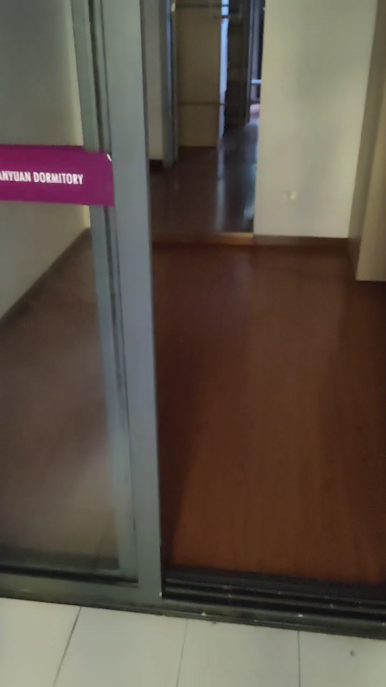

[【南京大学宿舍】南园十三舍：动线设计！三厅一室一阳台！_哔哩哔哩_bilibili](https://www.bilibili.com/video/BV1mK411f7FY/?share_source=copy_web&vd_source=7b5e4bb06c358101d13360d5ba402642)

#### 南园14舍：
开放式管理，无宿管无门禁，男女混住（笔者观察男性偏多），有少量租户住在底层。典型筒子楼，四人间人均14平。单栋楼共东、中、西三个单元，不互通。三个单元均为北侧交通，每单元四层、每层五户，从北向南依次为小厨房、客厅、卫生间（无热水、无通风、无采光）、卧室、阳台，卧室上床下桌，边户的客厅稍大些。装修情况各不相同，无公共浴室、洗衣间、热水间等配置。

#### 南园15、16舍：
无门禁，老校区筒子楼式建筑。三到四人一间，外部条件较差，但房间内有独立卫浴，三到四人住空间相对于普通宿舍楼大一些。

#### 南园18、19舍：
18、19舍为同一栋建筑的两个部分。女生宿舍，有门禁，本研混住，七层无电梯。三人间上床下桌，有直饮水机，一个三人用的大衣柜或者单独的连体式衣柜，无阳台、无独卫独浴，每层两个公共洗浴室（含三个坑位，洗手池）、两个阳台（在走廊的两个尽头， 一个略大， 一个极小），19舍1-3层、1 8 舍4-6 楼的公共洗浴室配有热水器（24h热水，新装了隔板）。一楼有洗衣房（含烘干机、热水间）、微波炉。整栋楼南北朝向，为内廊式，所以部分宿舍朝南、部分朝北。

#### 陶园南楼：
女生宿舍，刷卡进入，大门朝西开的独特二层”历史文物“建筑，每层有公共卫生间（四个）及浴室（24h热水最多可供8），宿舍大小不等，2-4人间均有。

#### 陶谷新村宿舍：
博士宿舍楼，一个套间包含2个单间，大部分单间是2人间，偶尔几个单间是单人间，独立卫浴，附带电梯。

### 附录彩蛋：
:::tips
附录：南园六舍（装修之前）的门联（作者为2014级历史学院硕士生张开春学长），与诸位共勉（狗头）：

:::

---

[南哪助手长期接受同学们投稿](https://www.yuque.com/greatnju/q-a/gw3phd#k6p5Y)

