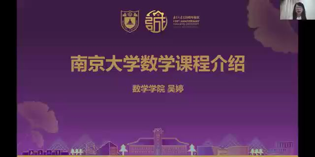

**【大学学习认知】如何学好大学数学基础课？**

大学，是一个全新的开始，不仅仅是学习生活物理空间的转换，还涉及到学习理念、思维方式等转变。

数学基础课是大学学习的重要基础，不仅能够帮助学生了解数学思想、掌握先进的数学方法与技巧，还能在从理论学习到实践应用探究的过程中培养批判性思维。

大学数学基础课程学什么？怎么学？为了帮助同学们尽快适应学习环境，走上学习成长的快车道，我们将为同学们介绍大学数学基础课程的学习方法，从“方法与基础”“能力与挑战”两个方面帮助大家提升学习兴趣，转变思维方式，提高学习能力。

对”方法与基础“专题感兴趣的新生可以加入**教学立方（课程邀请码： R64ENNJS  ）**展开学习，对“能力与挑战”专题感兴趣的同学可以加入**qq群（群号475465590）**，了解具体安排。

（这里本来应该有一个视频，但是语雀文档暂时不能上传视频，想看视频的同学请点击下方链接查看视频，或扫描下方的南哪24本科新生群二维码，在群文件中查看《南京大学数学课程介绍》）

[南京大学数学课程介绍（需复制链接至浏览器观看）](https://admission.nju.edu.cn/DFS//file/2024/08/02/20240802090439265wr4zt2.mp4)

[南哪助手长期接受同学们投稿](https://www.yuque.com/greatnju/q-a/gw3phd)

通知原文：

[【新生导学】如何学好大学数学基础课？](https://admission.nju.edu.cn//tzggsq/20240802/i271358.html)

