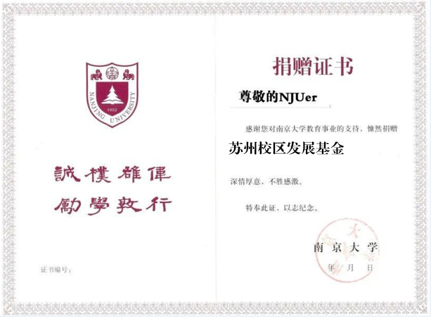

[南哪助手长期接受同学们投稿](https://www.yuque.com/greatnju/q-a/gw3phd#o8osi)

---

[https://njuedf.nju.edu.cn/36/e8/c4429a538344/page.htm](https://njuedf.nju.edu.cn/36/e8/c4429a538344/page.htm)

**捐赠方式**

**  
**

**方法一：微信捐赠**

**方法二：在线捐赠**

[https://weijuannew.nju.edu.cn/defpc/index/donate_detail/id/136.html](https://weijuannew.nju.edu.cn/defpc/index/donate_detail/id/136.html)

**方法三：****银行汇款**

捐赠账号：513158216454

开户行：中国银行南京广州路支行

户名：南京大学教育发展基金会

（来款请备注：苏州校区发展基金）

  

**五、****致谢与反馈**

  

1、南京大学将向捐赠人颁发捐赠感谢证书，并在南京大学教育发展基金会官方平台予以公布和鸣谢。

（登录后在个人中心查看，名字可以改）

2、针对捐赠金额情况，将对会议室、报告厅、庭院等公共空间进行**永久冠名**，或制作专门鸣谢牌。

3、根据捐赠额度和捐赠人意愿，拟给予以下荣誉身份——

聘请捐赠人为南京大学生科院发展委员会委员；

提请学校，聘任捐赠人为南京大学董事会成员（校董/名誉校董/名誉董事长）

4、捐赠人将获悉《捐赠项目报告》，或通过官方网络平台和基金会相关部门及时查阅和了解相关所捐项目运行情况。

5、根据捐赠实际情况和双方需求，邀请捐赠人来访与学子座谈交流。

---

[南哪助手长期接受同学们投稿](https://www.yuque.com/greatnju/q-a/gw3phd#k6p5Y)

