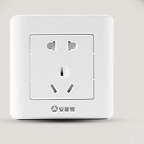
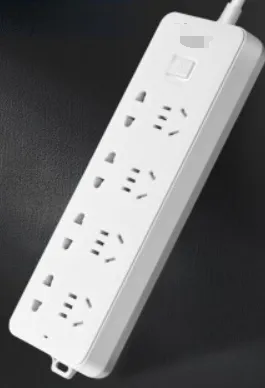
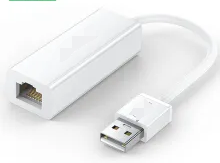
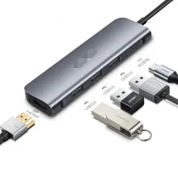
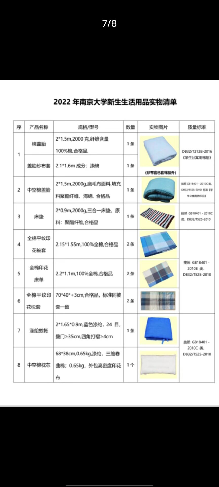
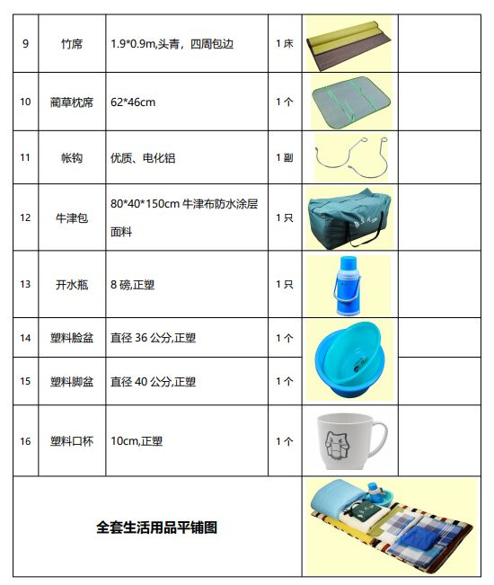

[南哪助手长期接受同学们投稿](https://www.yuque.com/greatnju/q-a/gw3phd#o8osi)

---

是否必需，请大家自行判断。校园内的教育超市里有的产品会标出，但在学校买选择较少，容易被宰。

## 一、互联网相关产品
### 1、电脑
电脑是大学学习生活过程中，必不可少的物品，建议大家大一入学能带电脑来学校，并且在入学前就掌握电脑的基本功能和使用方式。南大没有任何不允许大一携带电脑的禁令，离开电脑，很多正常的学习无法进行！宿舍既可以使用笔记本电脑，也可以配置台式机，大家可以根据自己的需求进行选择。

在选购电脑的过程中，助手有一些给大家的建议：首先要认准正版，尽量在线上的官方旗舰店购买。其次要考虑自己对电脑的需求，重量、外观、性能都是重要的指标。如果对选机有疑惑，可以咨询有经验的学长学姐（例如南大it侠鼓楼互助群2：861863787；2022年IT侠招新交流群：830126229）。

### 2、手机
手机是重要的通讯工具，建议大家要配有一部手机。选购手机有疑惑，也可以找it侠帮忙。

### 3、插线板（校园内教育超市有售）
插线板，建议大家使用大牌正版（假冒伪劣产品可能引起宿舍失火）

插线板线的长度，建议短一些。桌面的墙上有一个这样的插孔：

在床上的墙壁上，也有一个一样的。

所以，在桌面上配置插线板，只需要一米的线就足够了，再长的线会乱糟糟的。

插线板插孔位的数量，建议在三个以上：

举个例子（其实我个人认为usb口很鸡肋，毕竟现在手机都有快充）

### 4、网线、路由器（不建议购买路由器，对游戏有要求可以买0.5m网线直连电脑）
**现在不需要网线与路由器也可以直接在宿舍使用NJU-WLAN无线网络！**

详情见

[新生校园网使用指南](https://www.yuque.com/greatnju/q-a/vqnpi0)

在每个人桌前的墙上，都有一个校园网的网线接口（上边有“普天”字样），网线，买一米到两米的就足够了，这个建议提前准备好，因为学校里我最短只找到三米的卖，一般都是五米到十米……有些电脑没有网线接口，此时建议大家购买一个usb网线转接口或者type-c网线转接口：

其实，这种情况下，买拓展坞会更方便！

        如果想买路由器，建议提前买，学校的普遍卖的比较贵（但是质量一般），路由器的配置，按照它的说明书一步一步进行就可以了！

### 5、其他电子产品及配件
平板电脑（结合个人需求及专业需求）、电子阅读器（~~压泡面必备~~结合个人需求及兴趣）、充电宝（注意乘坐交通工具时的限制）、数据线及插头、转换插头、耳机、键盘、鼠标

## 二、床上用品（教育超市有售，同时学校给新生提供生活用品代办）
首先看生活用品代办清单（2022），基本涵盖了所有床上用品（贫困生可以免费领一套）：

如果没有特别追求生活品质，实际上学校的床上用品还是很合算的，比那些卖被子的学长学姐的被子要靠谱（他们卖被子提成在三分之一以上，被子质量不会特别好）。如果对床上用品有自己的需求，可以提前准备好，比如我自己不喜欢枕软枕头，家里给我准备了硬的枕头。

其他床上用品，比如床帘（给自己隐私空间、并且可以遮光）、床边挂篮（方便放东西，直接放靠墙可能会掉床缝里）、抱枕、床灯等，大家可以开学后体验决定是否购买。

## 三、生活用品
生活用品比较繁杂，我就不详细介绍可能的用处了。

### 1、能在学校超市买到的
新生报到时，教育超市人很多，需要排队很久。教育超市可以用校园卡刷卡、支付宝微信付款和现金付款。  
       衣架、撑衣杆（阳台的吊杆很高）、7号电池（空调遥控器上的）、垃圾桶、抹布、水杯、暖水瓶（前边的生活用品代办包含）、四六级耳机（收音耳机，可以提前购买）、各种文具、指甲剪等、收纳箱、纸巾、书立、矿泉水、挂锁、洗发水、沐浴露、洗衣液

### 2、能在学校超市买到的，但建议提前装备的
小件东西，能提前准备好的，就没必要在教超买。

台灯（虽然宿舍有大灯，但因为是上床下桌，桌面比较暗）（不建议在学校买）

台灯可以用LED灯条替代，占地更小。

各种洗漱用品（搓澡巾质量很差，北方同学建议自带）

雨伞（除了南大logo的伞，其他性价比很低）

### 3、不能在学校买到的
行李箱、书包、耳机（建议大家不要在宿舍开外放）、交通联合卡（不一定是南京的，只要有交通联合即可在南京地铁公交通行，也可以刷支付宝等进站乘车）、钱包、少许现金。

### 4、床帘详细描述
关于床帘的尺寸、支架等问题可以看宿舍全知道

### 5、部分生活用品清单（加粗可在学校买到）
1、衣物：T恤，裤子，内衣，睡衣，袜子，鞋子，外套，防晒服，帽子，浴巾，干发帽，拖鞋

**关于军训服装:学校统一发，鞋垫可以在学校超市里购买**

2、洗护用品：防晒用品、**洗漱用品**、皮肤清洁用品、护肤用品、剃须刀、**女性卫生用品**、化妆品、**毛巾/洗脸巾**、**盆**、**洗发水**、**沐浴露**、**洗衣液、**内衣专用皂/洗液

3、宿舍用品：水杯、梳子、头饰发夹、镜子、**床上用品**、**湿巾、卫生纸**、床帘（可以先洗一下避免有异味）、发带、**指甲钳、晾衣架、**收纳工具（建议开学根据需求网购）、**雨伞**、包、**书写工具、笔记本、**字典、**台灯、**书

4、和谐宿舍缔造者：床帘、耳塞/耳罩、U型枕

## 四、证件资料
1、录取通知书、身份证、高考准考证（准考证往年可以不带）三证原件

2、党、团组织关系介绍信

3、近期一寸、二寸彩色证件照数张，白色背景（保卫处，宿管各一张，最好备一下红蓝底与电子稿）

4、个人档案（有的高中会统一寄送）

5、户口迁移证（迁户口的同学带）

6、银行卡（牡丹灵通卡，要记得提前激活，缴费）

7、其余证件资料以新生入学指南（[南京大学迎新网 推荐公告 (nju.edu.cn)](https://admission.nju.edu.cn//tjgg/20240724/i271165.html)）为准。

**建议重要证件统一放在文件袋里以防丢失或遗落 **

## 五、防疫用品、药品

口罩、温度计（不建议使用水银温度计）、一次性手套等；

普通感冒药、消炎药等；

消毒水、碘伏、棉签和创可贴等；

许多药品可以等生病后去校医院开，比校外买便宜的多（因为你交了学校的医保），

---

[南哪助手长期接受同学们投稿](https://www.yuque.com/greatnju/q-a/gw3phd#k6p5Y)

