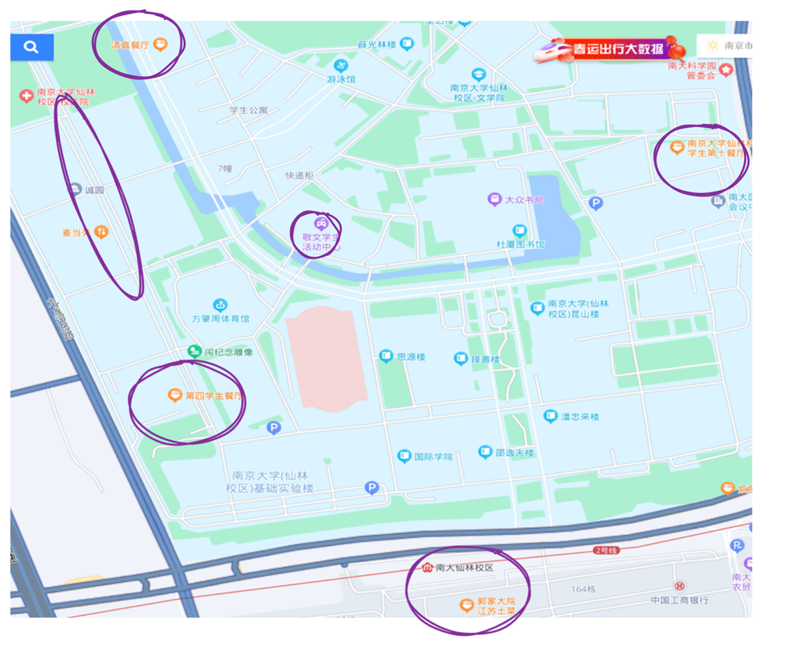

[南哪助手长期接受同学们投稿](https://www.yuque.com/greatnju/q-a/gw3phd#o8osi)

---

# 一组团附近
## 一栋
**一只酸奶牛**：酸奶、饮品、零食；

**通球眼镜店**；

**电脑医院**：修电脑、贴膜等，更建议找官方售后或校内找IT侠，联系方式见新生群汇总；

[【新生必看】2023新生群汇总（书院官方群必加）](https://www.yuque.com/greatnju/q-a/ew1is6)

**自行车维修**（一栋北）；

## 二栋
**好的便利店（二栋南）**；

**教育超市**：超市百货、早餐包子等；

**大唐文化（二栋南）**：文印、海报、证件照；

**学友二手书店（二栋北）**：二手书、纪念品、文具等；

## 三栋
**学友零食店**：零食、关东煮、包子等热食、三明治等；

**麦当劳**；

> 中国银行和中国建设银行的ATM机（是否正常使用不确定）
>

## 四栋
**罗森便利店**；

**雅思园打印**：打印文件；

**阿玛尼理发店**；

**品缘（小吃）**：炸串、便当、烤冷面；

**京东电脑数码**：各种连接线、电子产品等；

**洗衣店（四栋南进四栋院子）**：干洗衣物、洗鞋、缝补衣物等；

## 五栋
**卫星水果超市**：水果、水果捞、板栗等

**瑞幸咖啡**；

**三家营业厅**；

**几米数码图文**；

# 图书馆附近
**星巴克**：大活楼下；

**工商银行**：有柜员、办理银行业务、取社保卡等，大活楼下；

**大众书局**：自习、买书、咖啡等，图书馆西侧；

# 四组团
**教育超市：**24栋西侧；

**建设银行网点**：有柜员；

**瑞幸咖啡：**23栋西侧；

**哈尼家**：轻食，22栋东侧；

**锦程发艺**：22栋东侧；

**梦创书吧**：咖啡、甜品，十一食堂楼上众创空间；

# 校内其他咖啡
**第三领域**：环境学院中间；

**摩尔花园**：化学化工学院楼上，G区进门二楼；

**色值**：政府管理学院；

**其他**：新传、计科、生科院楼也有咖啡店哦

---

[南哪助手长期接受同学们投稿](https://www.yuque.com/greatnju/q-a/gw3phd#k6p5Y)

